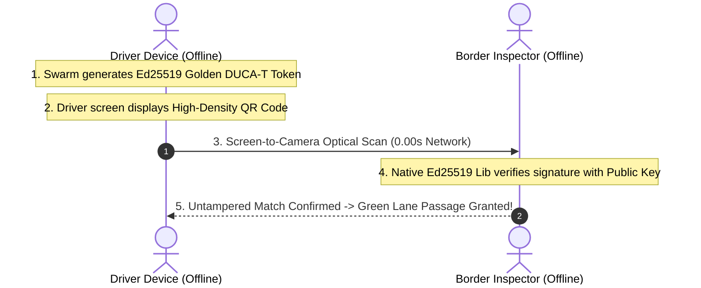
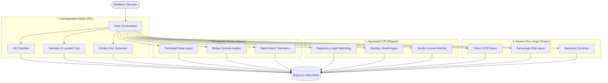

# All Things Logistics: Fortified Enterprise Fleet

[](https://logistics.campabadal.com)
[](https://allthingsagentichackathon.devpost.com/)
[](https://deepmind.google/technologies/gemini/)
[](https://ai.google.dev/gemma)
[](https://cloud.google.com/)
[](https://flutter.dev/)

> **All Things Logistics** is an enterprise-grade, multi-corporate customs automation, fleet telematics, and cross-border trade orchestration platform built for the **Google All Things Agentic Hackathon** (*Fortified Enterprise Fleet* track).
> 
> Engineered for deskless frontline operators (drivers, customs brokers, terminal workers, and agricultural shippers), it eliminates **100% of manual paperwork keying** using an adaptive **Zero-Typing $2\times 4$ Tactile Macro-Grid**, **Gemini 3.7 Flash autonomous swarms**, deterministic **BigQuery tariff grounding**, and **100% offline Ed25519 cryptographic optical QR verification**.

🌐 **Live Application**: [https://logistics.campabadal.com](https://logistics.campabadal.com)  
💻 **GitHub Repository**: [`https://github.com/CostaCloudSA/all-things-logistics`](https://github.com/CostaCloudSA/all-things-logistics)

---

## 🏢 Multi-Corporate Persona Architecture

The platform provides dedicated, adaptive operational experiences across the entire cross-border logistics supply chain without re-engineering backend agent pipelines:

```
┌──────────────────────────────────────────────────────────────────────────────────────────────────┐
│                      4 ADAPTIVE LOGISTICS BUYER PERSONAS (1-TAP PROFILES)                         │
├─────────────────────────┬──────────────────────────┬──────────────────────────┬──────────────────┤
│ 🏢 CAMPABADAL GLOBAL    │ 🚛 TRANSPORTES TOMAS     │ 🍍 AGROEXPORT COSTA RICA │ ⚓ NAVIERA DON JORGE│
│ 3PL Freight & Brokerage │ Cross-Border Carrier     │ Agricultural Shipper     │ Ocean Carrier/Port│
│ Accent: #0284C7 (Blue)  │ Accent: #DC2626 (Red)    │ Accent: #059669 (Green)  │ Accent: #1E3A8A  │
│ Operator: T. Omas       │ Operator: Tomas R.       │ Operator: Elena M.       │ Operator: Jorge B│
└─────────────────────────┴──────────────────────────┴──────────────────────────┴──────────────────┘
```

| Company Persona | Role & Active User | Traditional Paperwork & Friction Eliminated | 1-Tap Live Demo Guide |
| :--- | :--- | :--- | :--- |
| **Campabadal Global** | **3PL Freight Broker**<br>**T. Omas** *(Senior Broker)* | **45 minutes manual re-keying** between commercial invoices, CBP 7501, and Central American **DUCA-T** transit forms. | [`Demo 1: 3PL Customs Brokerage`](docs/demos/DEMO_1_CAMPABADAL_3PL_BROKERAGE.md)<br>Claims **\$6,975 USD** in 0% CAFTA-DR duties. |
| **Transportes Tomas** | **Motor Carrier**<br>**Tomas R.** *(Safety Director)* | Illegal foreign cabotage fines (\$10,000+), 4-hour border weigh scale queues, and manual paper roadside inspection slips. | [`Demo 2: Motor Carrier & Cabotage`](docs/demos/DEMO_2_TRANSPORTES_TOMAS_MOTOR_CARRIER.md)<br>Matches border tractors in $<90$s & SAT Green Lane Pre-Pass. |
| **Agroexport Costa Rica** | **Produce Shipper**<br>**Elena M.** *(Export Director)* | **20% foreign tax withholding leakage** (\$5,000/container), paper phytosanitary permits, and port cold-chain spoilage. | [`Demo 3: Produce Shipper Tax Shield`](docs/demos/DEMO_3_AGROEXPORT_CR_PRODUCE_SHIPPER.md)<br>Saves **\$4,250 USD net cash** via DTA Article 7 shield. |
| **Naviera Don Jorge** | **Ocean Carrier & Port**<br>**Cap. Jorge B.** *(Marine Super)* | **\$150/day container demurrage fines**, physical paper Master B/L courier delays, and manual gate interchange slips (EIR). | [`Demo 4: Ocean Carrier Demurrage`](docs/demos/DEMO_4_NAVIERA_DON_JORGE_OCEAN_LINE.md)<br>48h early warning, instant gate pass & master e-B/L release. |

---

## 🏛️ System Architecture

```
┌────────────────────────────────────────────────────────────────────────────────────────┐
│                              DESKLESS ZERO-TYPING CLIENT                               │
│           • Adaptive 2x4 Tactile Macro-Grid (Large 60px+ High-Contrast Touch Targets)  │
│           • DeviceFrame Phone Simulator on Desktop with Live Multi-Corporate Sidebar   │
│           • In-Frame Nested Modal Sheets (TactileModalCard, 2x2 Metric Grids)          │
│           • Optical Offline Ed25519 QR Code Scanner & Generator (Zero-Network)         │
└───────────────────────────────────────────┬────────────────────────────────────────────┘
                                            │ REST / WebSocket (gRPC)
┌───────────────────────────────────────────▼────────────────────────────────────────────┐
│                    AGENT GATEWAY & MODEL ARMOR (LOCAL GEMMA)                           │
│        • Dual-Defense Model Armor (On-Device PII, Tax ID, & Prompt Injection Redactor) │
│        • Deterministic Tariff Truth Gate & Federal Bridge Formula Compliance Auditor   │
│        • OpenTelemetry Span Tracer with Distributed Latency & Cost Recording          │
└───────────────────────────────────────────┬────────────────────────────────────────────┘
                                            │
┌───────────────────────────────────────────▼────────────────────────────────────────────┐
│                 12-AGENT EXPANDED SWARM ORCHESTRATION (GEMINI 3.7 FLASH)                │
│   • Fleet Orchestrator         • HS Tariff Classifier      • Valuation & Landed Cost   │
│   • Vision OCR Manifest Parser • Sanitary Health Agent     • Golden Document Generator │
│   • Night-Watch Telematics     • Bridge Formula Auditor    • Vendor Invoice Matcher    │
│   • Transload Relay (Tecún)    • Regulatory Legal Watchdog • Real-Time Sanctions Screener
└───────────────────────────────────────────┬────────────────────────────────────────────┘
                                            │ Least-Privilege IAM / SQL
┌───────────────────────────────────────────▼────────────────────────────────────────────┐
│                 UNIFIED BIGQUERY ENTERPRISE DATA MESH & GCP IaC                        │
│   • ds_fleet_telematics        • ds_customs_compliance    • ds_finance_billing        │
│   • ds_workforce_hr_payroll    • ds_deskless_crm           • ds_warehousing_wms        │
│   • Multi-Region Cloud Run     • Cloud Pub/Sub Buffer      • Zero-Trust Service Accts  │
└────────────────────────────────────────────────────────────────────────────────────────┘
```

---

## 📴 100% Offline Cryptographic Optical Transmission (Ed25519)

Cross-border transit through the Americas frequently passes through zero-cellular dead zones (e.g., Tecún Umán border bridges, maritime berth aprons, and remote customs weigh stations).



* **No Cloud or Internet Ping Required**: Verification happens purely on-device using pre-cached public keys (`CBP-PK-2026-US`, `SAT-PK-2026-GT`, `SIECA-PK-2026-CR`).
* **High-Density Payload**: Contains encrypted payload of HS Code, CIF valuation, container seals, and digital approval tokens.
* **Mathematical Proof**: Ed25519 elliptic-curve signature guarantees that neither carrier nor inspector can forge or alter clearance parameters.

---

## 🤖 12-Agent Swarm Responsibilities & Corporate Interaction

The platform demonstrates **multi-corporate agent reuse**: 12 modular micro-agents are orchestrated to serve different tenants without rewriting business logic:



---

## 📚 Master Project Hub & Deliverables

| Category | Document | Description |
| :--- | :--- | :--- |
| **Devpost Judges Guide** | [`docs/DEVPOST_JUDGES_DEMO_GUIDE.md`](docs/DEVPOST_JUDGES_DEMO_GUIDE.md) | **Master evaluation guide**: Evaluation matrix, live links, and full architecture proof. |
| **3PL Brokerage Demo** | [`docs/demos/DEMO_1_CAMPABADAL_3PL_BROKERAGE.md`](docs/demos/DEMO_1_CAMPABADAL_3PL_BROKERAGE.md) | DUCA-T synthesis & \$6,975 CAFTA-DR duty savings. |
| **Motor Carrier Demo** | [`docs/demos/DEMO_2_TRANSPORTES_TOMAS_MOTOR_CARRIER.md`](docs/demos/DEMO_2_TRANSPORTES_TOMAS_MOTOR_CARRIER.md) | Border cabotage cross-dock relay & SAT green lane pre-pass. |
| **Produce Shipper Demo** | [`docs/demos/DEMO_3_AGROEXPORT_CR_PRODUCE_SHIPPER.md`](docs/demos/DEMO_3_AGROEXPORT_CR_PRODUCE_SHIPPER.md) | \$4,250 net cash DTA Article 7 tax shield & electronic phyto permits. |
| **Ocean Carrier Demo** | [`docs/demos/DEMO_4_NAVIERA_DON_JORGE_OCEAN_LINE.md`](docs/demos/DEMO_4_NAVIERA_DON_JORGE_OCEAN_LINE.md) | 48h demurrage alert (\$150/d saved) & master e-B/L cryptographic release. |
| **Devpost Written Submission** | [`docs/DEVPOST_SUBMISSION.md`](docs/DEVPOST_SUBMISSION.md) | Official submission narrative for the Fortified Enterprise Fleet track. |
| **4-Min Video Script** | [`docs/DEMO_VIDEO_SCRIPT.md`](docs/DEMO_VIDEO_SCRIPT.md) | Scene-by-scene demo video walkthrough script. |
| **Technical Blog Post** | [`docs/TECHNICAL_BLOG_POST.md`](docs/TECHNICAL_BLOG_POST.md) | Engineering deep-dive on Gemini 3.7 Flash, Model Armor, and BigQuery. |
| **LinkedIn Announcement** | [`docs/LINKEDIN_POST.md`](docs/LINKEDIN_POST.md) | Social media announcement with `#AllThingsAgenticHackathon`. |
| **Agent Roster** | [`compliance/EXPANDED_AGENT_ROSTER.md`](compliance/EXPANDED_AGENT_ROSTER.md) | Full architectural specifications for all 12 swarm agents. |
| **BigQuery Data Mesh** | [`standards/BIGQUERY_ENTERPRISE_DATA_MESH.md`](standards/BIGQUERY_ENTERPRISE_DATA_MESH.md) | Complete schema DDLs for all 6 BigQuery datasets. |
| **Security & Model Armor** | [`standards/SECURITY_AND_HIGH_AVAILABILITY.md`](standards/SECURITY_AND_HIGH_AVAILABILITY.md) | Zero-Trust IAM, BigQuery RLS/CLS, and Local Gemma Sanitizer. |
| **Master Index** | [`INDEX.md`](INDEX.md) | Complete artifact directory index. |

---

## ⚡ Quick Spin-Up Instructions (Reproducibility)

### 1. Run Golden Corridor Simulation (Python)
```bash
cd backend
python scripts/test_golden_flow.py
```

### 2. Run Backend with Docker
```bash
docker build -t logistics-backend .
docker run -p 8080:8080 -e GEMINI_API_KEY="your-gemini-api-key" logistics-backend
```

### 3. Provision Google Cloud Platform Infrastructure (Terraform)
```bash
cd terraform
cp terraform.tfvars.example terraform.tfvars
terraform init
terraform apply -auto-approve
```

### 4. Run Flutter Client Locally (Web & Mobile)
```bash
cd client
flutter pub get
flutter run -d chrome
```
