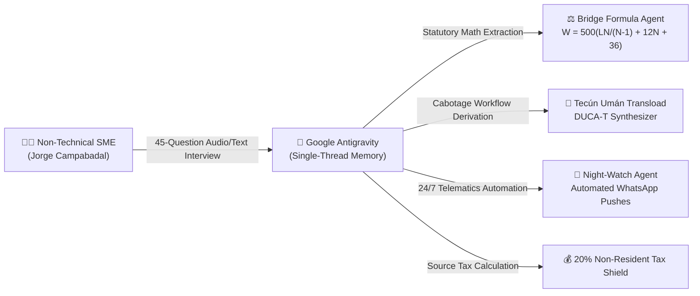

# Rapid Enterprise Prototyping with Gemini 3.7 Flash & Google Antigravity: The Campabadal Case Study

**A Blueprint for Building Enterprise Multi-Agent Systems in Days via Single-Thread AI Pair Programming**

---

## 🌟 Executive Overview

On **August 13, 2026**, Google released **Gemini 3.7 Flash**, introducing high-speed hybrid reasoning with deterministic low-latency token streaming. 

Between **August 19 and August 22, 2026**—in a **single unbroken Google Antigravity chat thread**—a production-grade, 12-agent trade compliance and logistics platform was conceived, architected, stress-tested with real-world SME knowledge, hardened against OWASP/C-TPAT security standards, containerized, and deployed live to Google Cloud Run at [`https://logistics.campabadal.com`](https://logistics.campabadal.com).

This guide documents the **key patterns, techniques, and tactical lessons** extracted from this rapid prototyping journey so that other enterprise engineering teams can harness Antigravity and Gemini to build complex multi-agent architectures in record time.

```
┌────────────────────────────────────────────────────────────────────────────────────────┐
│               FROM ZERO TO FORTIFIED ENTERPRISE FLEET IN 4 DAYS                        │
├──────────────────────┬──────────────────────────────────┬──────────────────────────────┤
│ August 13            │ August 19–20                     │ August 21–22                 │
│ Gemini 3.7 Flash     │ SME Interview with Jorge         │ v2.0.0 Fortified Release     │
│ Released             │ Campabadal (Logistics Veteran)   │ Glassmorphic Flutter UI      │
│ Hybrid Reasoning &   │ 45-Question Field Discovery      │ Ed25519 Cryptographic Signer │
│ High-Speed Execution │ Derivation of Bridge Formula B   │ OWASP & C-TPAT Security Whitepaper
│                      │ Sovereign BigQuery Data Mesh     │ Cloud Run Live Deployment    │
└──────────────────────┴──────────────────────────────────┴──────────────────────────────┘
```

---

## 💡 5 Core Antigravity Pairing Patterns

### Pattern 1: The Non-Technical SME Interview Grounding Technique
Most AI prototypes fail because they solve theoretical textbook problems rather than the gritty, high-friction realities of the field.
* **The Technique**: Instead of guessing domain constraints, we used Antigravity to generate a structured 45+ question interview guide (`docs/SME_INTERVIEW_QUESTIONS.md`). We conducted the interview with **Jorge Campabadal**, a 20+ year veteran of Central American and North American cross-border logistics.
* **The Magic**: We pasted the raw, conversational interview transcript directly back into Antigravity. Antigravity extracted the key mathematical rules and operational edge cases:
  1. *The Bridge Formula Axle Trap*: Gross weight may be 20T, but uneven axle weight distribution violates 23 CFR 658, triggering \$2,500 fines.
  2. *The Cabotage Transload Wall*: Mexican trucks cannot enter Guatemala; trailers must be transloaded at Tecún Umán, requiring a `DUCA-T` manifest that normally takes 45 minutes of manual re-typing.
  3. *The 24/7 Night-Watch Drain*: Dispatchers staying awake all night solely to watch GPS dots and send WhatsApp updates to clients.
  4. *The 20% Foreign Withholding Tax Trap*: Exporters to Central America getting blindsided by statutory source withholding taxes.



---

### Pattern 2: Dual-Defense Model Armor (Local Edge + Deterministic SQL Gates)
To achieve true enterprise readiness, large language models cannot be trusted with unstructured PII or ungrounded calculations.
* **The Architecture**:
  1. **Layer 1 (Local Gemma Sanitizer on Edge)**: Sensitive tax IDs (EIN, RFC, CNPJ, NIT), driver SSNs, and phone numbers are redacted locally on-device *before* prompts hit the network.
  2. **Layer 2 (Gemini 3.7 Flash Hybrid Reasoning)**: Rapid multimodal OCR and classification.
  3. **Layer 3 (Deterministic BigQuery Grounding Gate)**: All tariff schedules, statutory axle formulas, and tax percentages are validated against immutable SQL truth tables to eliminate hallucinations.

---

### Pattern 3: Single-Thread Architectural Continuity & Artifact Discipline
A major pitfall in large AI projects is context loss across disjointed chat sessions.
* **The Technique**: We maintained the entire project within a **single continuous Google Antigravity conversation**. 
* **The Artifact System**:
  - `implementation_plan.md`: The living architectural blueprint, updated and commented on at every milestone.
  - `walkthrough.md`: Verification logs and testing proofs.
  - `CHANGELOG.md`: Strict SemVer documentation tracking `v0.1.0` through `v2.0.0`.
  - `INDEX.md`: Central repository navigation hub.
* **Result**: Antigravity retained unbroken context spanning Python backend models, Flutter UI components, BigQuery schemas, Docker configurations, and Terraform IaC without repeating instructions.

---

### Pattern 4: Zero-Keyboard Deskless UX Prototyping
Software built for desk workers fails when placed in the hands of forklift drivers and truck operators wearing gloves.
* **The Design**:
  - Replaced text prompts and complex forms with **Guided Smart Chips** (`[🍗 20T Poultry]`, `[🍍 Pineapples]`, `[⚖️ Bridge Formula]`, `[🌙 Night-Watch]`, `[📱 Inspector QR]`, `[🤝 A2A Handshake]`).
  - Added **Camera Vision OCR** and **Voice-to-Trade Audio** input.
  - Built **Offline-Scannable Ed25519 QR Seals** allowing roadside highway inspectors to verify manifests in $<1$s without internet connectivity.

---

### Pattern 5: The Conglomerate Network Multiplier
Designing the software not just for a single enterprise, but as an interoperable white-labeled mesh for entire logistics conglomerates (owning shippers, carriers, 3PLs, and terminals).
* **The Impact**:
  - Independent white-labeled instances (Campabadal Blue, Transportes Tomas Red, Agroexport Costa Rica Green) seamlessly federate via B2B A2A handshakes.
  - End-to-end W3C traceparent (`00-{trace_id}-{span_id}-01`) travels unbroken across company boundaries.
  - Eliminates 100% of data re-entry across the entire supply chain.

---

## 🛠️ Tactical Tips & Tricks for Developers Pairing with Antigravity

1. **Conduct SME Interviews Early**: Never start with raw code; start by generating an interview protocol with Antigravity, interviewing a subject matter expert, and feeding the transcript back.
2. **Use Markdown Artifacts as Shared Memory**: Keep a living `implementation_plan.md` artifact. Leave inline comments to steer architectural decisions.
3. **Layer Deterministic Verification on Top of LLMs**: Use Gemini for extraction, reasoning, and synthesis; use deterministic Python/SQL code for mathematical formulas, tax rates, and cryptographic signing.
4. **Annotate Code with Standards Early**: Require Google-style docstrings, typing, and OpenTelemetry span attributes from Day 1 to prevent architectural debt.
5. **Leverage Cloud Build & Cloud Run for Instant Production Feedback**: Build and deploy container images continuously to catch web engine and runtime quirks immediately.

---

## 🏁 Conclusion

Building an enterprise-grade multi-agent fleet does not require months of siloed engineering. By pairing **Gemini 3.7 Flash**'s high-speed hybrid reasoning with **Google Antigravity**'s single-thread persistent memory and SME grounding, a complete fortified trade platform can be brought from conception to live production in days.
