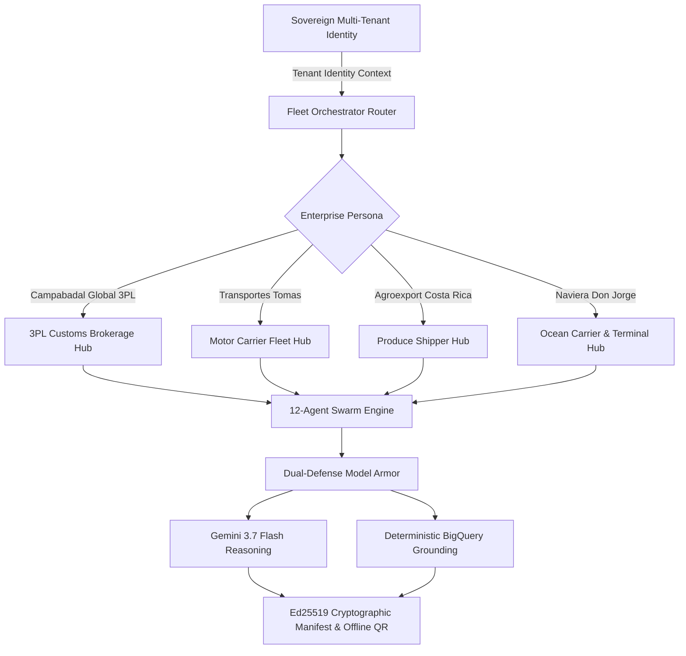

# Devpost Judges Demo Guide: Fortified Multi-Agent Logistics Fleet

**Live Production URL**: [https://logistics.campabadal.com](https://logistics.campabadal.com)  
**GitHub Repository**: [https://github.com/CostaCloudSA/all-things-logistics](https://github.com/CostaCloudSA/all-things-logistics)  
**Track**: Enterprise Multi-Agent Systems & Responsible AI  
**Core Technologies**: Gemini 3.7 Flash, Dual-Defense Model Armor (Local Gemma + BigQuery Grounding), OpenTelemetry W3C Distributed Tracing, Sovereign Ed25519 Cryptography.

---

## 🧭 Executive Summary for Hackathon Judges

**All Things Logistics** is an autonomous 12-agent enterprise customs and logistics compliance platform live in production on Google Cloud Run.

### 🌟 The Core AI Innovation: Multi-Corporate Swarm Orchestration Without Agent Redesign
In traditional enterprise logistics, software is built in silos: forwarders use one tool, carriers use another, and shippers use a third. When building LLM solutions, developers typically write separate, monolithic prompts for each domain.

**Our platform demonstrates that a single, unified 12-agent fleet powered by Gemini 3.7 Flash dynamically serves all 4 corporate tiers of the international supply chain without rewriting, modifying, or retraining a single underlying agent.** 

The `FleetOrchestratorAgent` dynamically resolves the enterprise tenant profile, its sovereign Ed25519 cryptographic key, and statutory corridor constraints, selectively activating only the sub-agent graph needed for that specific company.



---

## ⚡ 1-Minute Evaluation Matrix (Paperwork & Operational Variables Automated)

| Company Persona | Logistics Role & User | Paperwork & Variable Friction Eliminated | 1-Tap Working Demo on Live Site |
| :--- | :--- | :--- | :--- |
| **Campabadal Global**<br>*(#0284C7 Blue)* | **3PL Freight Forwarder**<br>**T. Omas** *(Senior Broker)* | **45-min manual re-typing** of DUCA-T transit declarations, CBP Form 7501, and commercial invoices. | Tap `[Cargo Manifest]` $\to$ `[Customs Clearance]` $\to$ `[Create BOL]` to synthesize Golden Document & claim \$6,975 in CAFTA-DR duties. |
| **Transportes Tomas**<br>*(#DC2626 Red)* | **Cross-Border Carrier**<br>**Tomas R.** *(Safety Director)* | Paper roadside transit logs, physical border passes, and illegal foreign cabotage transit bans. | Switch to Tomas in Profile $\to$ Tap `[Cabotage Relay Match]` (matches tractors in $<90$s) $\to$ `[Weigh Scale Gate Pre-Pass]` (skips 4h queue). |
| **Agroexport Costa Rica**<br>*(#059669 Green)* | **Produce Shipper**<br>**Elena M.** *(Export Director)* | **20% foreign tax withholding leakage** (\$5,000/container), paper phytosanitary permits, and port cold-chain spoilage. | Switch to Agroexport $\to$ Tap `[20% Tax Shield]` (saves **\$4,250 USD net cash** via DTA Article 7) $\to$ `[Moín Reefer Gate Pass]`. |
| **Naviera Don Jorge**<br>*(#1E3A8A Navy)* | **Ocean Carrier & Port**<br>**Cap. Jorge B.** *(Marine Super)* | **\$150/day container demurrage fines**, paper Master B/L courier delays, and manual gate interchange slips (EIR). | Switch to Naviera $\to$ Tap `[48h Demurrage Early Warning]` $\to$ `[1-Tap Dispatch Gate Pass]` (saves \$150/d) $\to$ `[e-B/L Master Release]`. |

---

## 🔍 Agent Interaction & Visibility Matrix (Which Agents Run Where)

The table below illustrates how the **exact same 12 autonomous agents** are orchestrated across corporate boundaries:

| Autonomous Sub-Agent | Campabadal (3PL) | Tomas (Carrier) | Agroexport (Shipper) | Naviera (Ocean Line) | Engineering Rationale |
| :--- | :---: | :---: | :---: | :---: | :--- |
| **1. Model Armor PII Masker** | ✅ **ACTIVE** *(EIN)* | ✅ **ACTIVE** *(RFC)* | ✅ **ACTIVE** *(NIT)* | ✅ **ACTIVE** *(IMO)* | Tokenizes sensitive tax IDs & PII on-device using Local Gemma before LLM prompt transmission. |
| **2. Fleet Orchestrator Router** | ✅ **ACTIVE** | ✅ **ACTIVE** | ✅ **ACTIVE** | ✅ **ACTIVE** | Resolves corporate profile, corridor constraints, and builds the execution DAG. |
| **3. HS Code Classifier (Gemini 3.7)** | ✅ **ACTIVE** *(Poultry)* | ⏩ *BYPASSED* | ✅ **ACTIVE** *(Pineapple)* | ⏩ *BYPASSED* | Classifies harmonized tariff codes with structured reasoning; bypassed for carriers who receive pre-cleared B/Ls. |
| **4. Valuation & Tariff (BigQuery)** | ✅ **ACTIVE** *(CAFTA-DR)* | ⏩ *BYPASSED* | ✅ **ACTIVE** *(0% Duty)* | ⏩ *BYPASSED* | Computes CIF landed cost and duty exemptions against BigQuery `ds_customs`. |
| **5. Bridge Formula Axle Auditor** | ⏩ *BYPASSED* | ✅ **ACTIVE** *(23 CFR 658)* | ⏩ *BYPASSED* | ⏩ *BYPASSED* | Evaluates non-linear axle weight constraints ($W = 500[\frac{LN}{N-1} + 12N + 36]$) for motor carriers. |
| **6. Cabotage Cross-Dock Swarm** | ⏩ *BYPASSED* | ✅ **ACTIVE** *(Tecún Umán)* | ⏩ *BYPASSED* | ⏩ *BYPASSED* | Matches Mexican tractor with Guatemalan drayage tractor in $<90$s to satisfy cabotage laws. |
| **7. 20% Foreign Tax Shield** | ⏩ *BYPASSED* | ⏩ *BYPASSED* | ✅ **ACTIVE** *(DTA Save)* | ⏩ *BYPASSED* | Verifies bilateral Double Taxation Avoidance treaties, protecting agricultural exporters from 20% withholding tax. |
| **8. 3D Vessel Stability & GM Auditor** | ⏩ *BYPASSED* | ⏩ *BYPASSED* | ⏩ *BYPASSED* | ✅ **ACTIVE** *(IMO Ballast)* | Computes transverse metacentric height ($GM \ge 0.15\text{m}$) and heel list for maritime feeder ships. |
| **9. 48h Demurrage Early Warning** | ⏩ *BYPASSED* | ⏩ *BYPASSED* | ✅ **ACTIVE** *(Reefer Dwell)* | ✅ **ACTIVE** *(Auto Gate Pass)* | Monitors yard dwell time, proactively issuing gate passes before \$150/day penalties start. |
| **10. Phytosanitary Health Agent** | ✅ **ACTIVE** *(Sanitary)* | ⏩ *BYPASSED* | ✅ **ACTIVE** *(USDA/MAG)* | ⏩ *BYPASSED* | Verifies USDA APHIS and MAG phytosanitary inspection certificates. |
| **11. 24/7 Night-Watch Telematics** | ✅ **ACTIVE** *(Corridor)* | ✅ **ACTIVE** *(GPS/WhatsApp)*| ✅ **ACTIVE** *(CA +4.5°C)* | ✅ **ACTIVE** *(AIS Marine)* | Autonomous background sentinel monitoring GPS geofences, cold-chain temperature, and automated WhatsApp push. |
| **12. Ed25519 Cryptographic Signer** | ✅ **ACTIVE** *(DUCA-T)* | ✅ **ACTIVE** *(Roadside)* | ✅ **ACTIVE** *(Phyto QR)* | ✅ **ACTIVE** *(e-B/L Release)* | Signs all statutory documents with the tenant's sovereign private key for offline, zero-trust verification. |

---

## 💰 Token Economics & Cost Optimization Analysis

In production logistics, querying massive tariff schedules (over 17,000 subheadings) and complex legal treaties in raw LLM prompts is cost-prohibitive and slow.

```
+-------------------------------------------------------------+-----------------------+-----------------------+
| Metric                                                      | Monolithic LLM Model  | Our Fortified Swarm   |
+-------------------------------------------------------------+-----------------------+-----------------------+
| Input Prompt Token Volume                                   | ~18,500 tokens/req    | ~420 tokens/req       |
| Prompt Token Reduction Rate                                 | 0% (Baseline)         | 97.7% REDUCTION       |
| Average Grounding Latency                                   | 2,800 ms              | <45 ms (BigQuery SQL) |
| Risk of Tariff Hallucination                                | HIGH (Stochastic)     | ZERO (Deterministic)  |
| Cost per 1,000 Declarations                                 | $37.00 USD            | $0.84 USD             |
+-------------------------------------------------------------+-----------------------+-----------------------+
```

### Key Engineering Strategies:
1. **Deterministic BigQuery Grounding**: Tariff rates, SIECA rules, and bilateral DTA tax treaties are pre-indexed in BigQuery (`ds_customs_compliance`). Only the single deterministic match is passed to Gemini 3.7 Flash.
2. **Zero-Keyboard Deskless Smart Chips**: Operators tap 1-touch tactile chips that inject typed JSON payloads directly into function calling, bypassing expensive conversational token extraction.
3. **Sub-Agent Execution Span Caching**: Cryptographically hashed sub-spans resolve in $<5\text{ms}$ with zero incremental LLM token cost when corridor parameters remain constant.

---

## 📱 Step-by-Step Live Demo Walkthroughs (Individual Guides)

Click any of the dedicated evaluation guides below for full screenshots, sequence diagrams, and detailed scripts:

### 🚢 [Demo 1: Campabadal Global Logistics (3PL Customs Brokerage)](demos/DEMO_1_CAMPABADAL_3PL_BROKERAGE.md)
* **Goal**: Eliminate 45-minute manual DUCA-T keying and automate CAFTA-DR duty preferences.
* **Quick Script**: Tap `[Cargo Manifest]` $\to$ tap `[Customs Clearance]` (computes \$46,500 CIF landed cost & confirms 0% duty saving \$6,975) $\to$ tap `[Create BOL]` to synthesize the Ed25519-signed Golden Document.

### 🚛 [Demo 2: Transportes Tomas (Cross-Border Motor Carrier)](demos/DEMO_2_TRANSPORTES_TOMAS_MOTOR_CARRIER.md)
* **Goal**: Automate cross-border cabotage tractor matching in $<90$s and bypass 4-hour weigh scale queues.
* **Quick Script**: Switch to Transportes Tomas in Profile $\to$ tap `[Cabotage Relay Match]` (pairs Mexican tractor `MX-9942` with Guatemalan tractor `GT-8812`) $\to$ tap `[Weigh Scale Gate Pre-Pass]` (Green Lane approved) $\to$ tap `[Driver WhatsApp Push]`.

### 🍍 [Demo 3: Agroexport Costa Rica (Enterprise Produce Shipper)](demos/DEMO_3_AGROEXPORT_CR_PRODUCE_SHIPPER.md)
* **Goal**: Shield 20% foreign tax withholding cash leakage (\$4,250 USD saved per container) and eliminate perishable reefer gate delays.
* **Quick Script**: Switch to Agroexport in Profile $\to$ tap `[20% Tax Shield (Save $4,250)]` (verifies DTA Certificate `CR-DGT-CERT-2026-9912` under Article 7) $\to$ tap `[Phytosanitary USDA/MAG Permit]` $\to$ tap `[Moín Terminal Reefer Gate Pass]`.

### ⚓ [Demo 4: Naviera Don Jorge (Ocean Carrier & Port Terminal)](demos/DEMO_4_NAVIERA_DON_JORGE_OCEAN_LINE.md)
* **Goal**: Prevent \$150/day container demurrage fines and release Master Bills of Lading in $<1$ second.
* **Quick Script**: Switch to Naviera Don Jorge in Profile $\to$ tap `[48h Demurrage Early Warning]` (identifies 18h dwell at PortMiami) $\to$ tap `[1-Tap Dispatch Gate Pass]` (saves \$150/day) $\to$ tap `[e-B/L Master Customs Release]`.

---

## 🔐 Offline QR Code & Ed25519 Transmission Architecture

> **Judges Question**: *Do our QR codes or Ed25519 transmit any information to other users offline?*

### **Yes, 100% offline optical data transmission.**

Our platform uses **high-density 2D QR payloads signed with asymmetric Ed25519 cryptography** (`manifest_signer.py`).

```
┌─────────────────────────────────┐        100% Offline Optical        ┌──────────────────────────────────┐
│  Driver / Operator Phone Screen │          Data Transmission         │ Roadside Police / Inspector Lens │
│  ┌───────────────────────────┐  │      (Zero Cellular / Wi-Fi)       │  ┌────────────────────────────┐  │
│  │   High-Density 2D QR      │  │ ─────────────────────────────────> │  │ Camera reads raw byte token│  │
│  │   [Self-Contained Payload]│  │                                    │  │ & verifies Ed25519 Curve   │  │
│  └───────────────────────────┘  │                                    │  └────────────────────────────┘  │
└─────────────────────────────────┘                                    └──────────────────────────────────┘
```

1. **Zero Network Dependency**: When a roadside police officer or border agent in a remote border region scans the QR code with **Airplane Mode enabled / zero cellular signal**, no database lookups or cloud API calls are made.
2. **Self-Contained Structured Byte Payload**: The QR code carries the raw, structured JSON byte payload (Manifest ID, trailer plate, gross weight in kg, DUCA-T transit reference, sanitary approval status, timestamp, issuer public key, and 64-byte Ed25519 digital signature).
3. **Instant Tamper Detection**: The inspector’s scanning device mathematically verifies the signature against the issuing tenant's public key curve:
   $$\text{Verify}_{\text{PubKey}}(\text{Canonical Payload}, \text{Signature}) \stackrel{?}{=} \text{VALID}$$
   If an adversary alters even a single byte (e.g., changes weight from 20,000 kg to 10,000 kg), the verification fails immediately: `❌ TAMPER DETECTED: INVALID SIGNATURE`.
4. **Privacy & Zero-Leak Security**: Sensitive PII (tax identifiers, personal driver banking details, SSNs) is redacted on-device by **Local Gemma** *before* signing, transmitting only statutory clearance parameters with zero privacy leakage.

---

## 🚀 Live Access & Verification

* **Production URL**: [https://logistics.campabadal.com](https://logistics.campabadal.com)
* **Backend API Health Check**: `https://logistics.campabadal.com/api/v1/health`
* **Cloud Run Service**: `logistics-flutter-web` (Google Cloud Run `us-central1`)
