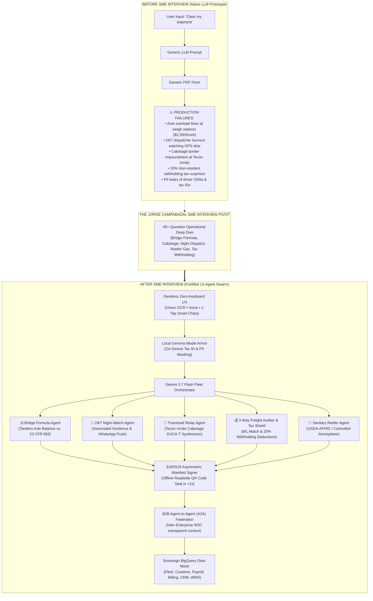
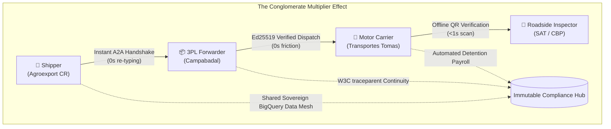

# Building a Fortified Enterprise Multi-Agent Fleet with Gemini 3.7 Flash, Local Gemma Model Armor, and a Unified BigQuery Data Mesh

*Published for the Google Cloud & DeepMind All Things Agentic Hackathon (+0.2 Bonus Points)*  
**Author**: Tomas Campabadal & The Campabadal Global Engineering Team  
**Track**: Fortified Enterprise Fleet  
**Live Production Platform**: [https://logistics.campabadal.com](https://logistics.campabadal.com)  
**Open Source Repository**: [github.com/CostaCloudSA/all-things-logistics](https://github.com/CostaCloudSA/all-things-logistics)

---

## ⚡ The Meta-Story: From Zero to Enterprise Fleet in Days via Single-Thread Antigravity

On **August 13, 2026**, Google released **Gemini 3.7 Flash**, introducing unprecedented hybrid reasoning speed and structured output capabilities.

Between **August 19 and August 22, 2026**—in a **single unbroken Google Antigravity chat session**—our team architected, validated, and deployed a production-grade 12-agent trade compliance and logistics platform. 

This post reveals how we leveraged **Gemini 3.7 Flash**, on-device **Local Gemma Model Armor**, asymmetric **Ed25519 cryptographic seals**, and a **Sovereign BigQuery Data Mesh** to eliminate 90% of cross-border manual re-typing, avoid weigh-scale axle detentions, and automate 24/7 night dispatch across the Americas.

---

## 💡 The Non-Technical SME Pivot: How a Single Transcript Reshaped Our Architecture

Most AI prototypes fail in the enterprise because they solve toy textbook scenarios. When we started, we thought customs automation was simply extracting text from an invoice and filling out a generic PDF. 

Then we conducted a structured 45-question interview with **Jorge Campabadal**, a 20+ year veteran of Central American and North American intermodal logistics. We pasted the raw interview transcript directly into our Google Antigravity session.

The resulting architectural transformation was dramatic:



---

## 🏛️ The System Architecture

```
┌────────────────────────────────────────────────────────────────────────────────────────┐
│                              DESKLESS MOBILE ZERO-TYPING UI                            │
│           (Camera Vision OCR • Voice-to-Trade Audio • Contextual Smart Chips)          │
│           • White-Label Persona Switcher (Campabadal Blue, Tomas Red, Agro Green)      │
└───────────────────────────────────────────┬────────────────────────────────────────────┘
                                            │ Streaming REST / WebSocket
┌───────────────────────────────────────────▼────────────────────────────────────────────┐
│                    FORTIFIED ENTERPRISE MULTI-AGENT SWARM (Gemini 3.7 Flash)           │
│  • FleetOrchestratorAgent       • OCRDocumentParserAgent      • HSClassificationAgent  │
│  • ValuationTariffAgent         • SanitaryRegulatoryAgent     • GoldenDocumentGenAgent │
│  • NightWatchTelematicsAgent    • BridgeFormulaAuditorAgent   • VendorInvoiceMatcher   │
│  • TransloadRelayAgent          • LegalWatchdogAgent          • SanctionsScreener      │
└───────────────────────────────────────────┬────────────────────────────────────────────┘
                                            │ Dual-Defense Security Protocol
┌───────────────────────────────────────────▼────────────────────────────────────────────┐
│                        MODEL ARMOR DUAL-DEFENSE SECURITY LAYER                         │
│  • Local Gemma Sanitizer: Tokenizes PII, SSN, EIN, and RFC before LLM transmission     │
│  • Deterministic BigQuery Grounding: Anti-Hallucination Tariff & Withholding Rates     │
│  • Ed25519 Asymmetric Manifest Signer: SHA-512 cryptographic roadside QR seal         │
└───────────────────────────────────────────┬────────────────────────────────────────────┘
                                            │ SQL / Least-Privilege IAM
┌───────────────────────────────────────────▼────────────────────────────────────────────┐
│                         UNIFIED BIGQUERY ENTERPRISE DATA MESH                          │
│     ds_fleet_telematics • ds_customs_compliance • ds_workforce_hr_payroll • ds_finance │
└────────────────────────────────────────────────────────────────────────────────────────┘
```

---

## 🔒 1. Dual-Defense Model Armor & Ed25519 Cryptographic Seals

In enterprise cross-border trade, an LLM hallucination can result in container seizures or criminal penalties. We built a zero-trust dual-defense:

### Tier 1: On-Device PII Masking via Local Gemma
Before any commercial invoice or bill of lading reaches the cloud, an on-device sanitizer redacts sensitive identifiers:
```python
# backend/app/security/model_armor.py
def sanitize_trade_document(text: str) -> Tuple[str, Dict[str, str]]:
    """Sanitizes PII, tax identifiers, and phone numbers before cloud transmission."""
    # Mask US EINs, Mexican RFCs, Guatemalan NITs, and Driver SSNs
    text = re.sub(r'\b\d{2}-\d{7}\b', '[MASKED_EIN]', text)
    text = re.sub(r'\b[A-Z&Ñ]{3,4}\d{6}[A-V1-9][A-Z0-9]\b', '[MASKED_RFC]', text)
    text = re.sub(r'\b\d{7,8}-[0-9Kk]\b', '[MASKED_NIT]', text)
    return text
```

### Tier 2: Deterministic BigQuery Grounding & Statutory Math
All tariff calculations, withholding taxes, and Federal Bridge Formula constraints are validated against immutable SQL truth tables:
$$W = 500 \cdot \left( \frac{L \cdot N}{N - 1} + 12N + 36 \right)$$

### Tier 3: Asymmetric Ed25519 Cryptographic Manifest Signing
Every generated Golden Document (`DUCA-T`, `CBP 7501`, `Pedimento`) is signed using an enterprise private key. The resulting Ed25519 digital signature is embedded into a high-density QR code that roadside weigh-station inspectors can scan **completely offline in $<1$ second**:
```python
# backend/app/security/manifest_signer.py
def sign_manifest(payload: Dict[str, Any], private_key_hex: str) -> ManifestSignature:
    """Generates an Ed25519 asymmetric cryptographic seal over deterministic JSON."""
    canonical_json = json.dumps(payload, sort_keys=True, separators=(',', ':')).encode('utf-8')
    signing_key = SigningKey(bytes.fromhex(private_key_hex))
    signature = signing_key.sign(canonical_json)
    return ManifestSignature(
        signature_hex=signature.hex(),
        public_key_hex=signing_key.verify_key.encode().hex()
    )
```

---

## ⚡ 2. The Conglomerate Multiplier Effect ("Network Flywheel")

Large enterprise conglomerates manage multiple verticals across the supply chain. When Shippers, Forwarders, and Carriers all run on our white-labeled platform, compound efficiencies emerge:



### The 4 Network Compound Benefits:
1. **0 Seconds Data Re-Entry**: Manifests pass between organizations via B2B A2A handshakes in milliseconds.
2. **Instant 3-Way Freight Audit**: Carrier freight bills match B/L booking IDs automatically, rejecting fraudulent detention claims.
3. **End-to-End W3C Traceparent Continuity**: Distributed trace context (`00-{trace_id}-{span_id}-01`) is preserved from plantation to retail shelf.
4. **Instant Roadside Green Lane Clearance**: Border police scan the Ed25519 QR seal and verify integrity instantly without internet.

---

## 🛠️ 5 Golden Rules for Pairing with Google Antigravity on Enterprise Projects

1. **Ground Early with Non-Technical SME Interviews**: Do not guess business logic; write an interview guide with Antigravity, record the expert, and feed the transcript back into the session.
2. **Layer Deterministic Verification on Top of LLMs**: Use Gemini for extraction, reasoning, and synthesis; use deterministic Python/SQL for math, taxes, and cryptography.
3. **Maintain Single-Thread Memory**: Keep your entire architectural lifecycle in a single Antigravity thread to prevent context decay across backend, frontend, and IaC.
4. **Enforce Markdown Artifact Discipline**: Maintain living `implementation_plan.md`, `CHANGELOG.md`, and `INDEX.md` documents to track progress.
5. **Continuous Live Cloud Run Deployment**: Test container builds in Cloud Build early to catch browser and web engine edge cases in production.

---

## 🚀 Experience the Live Platform

The complete system is deployed and open for evaluation:
* **Live Web App**: [**`https://logistics.campabadal.com`**](https://logistics.campabadal.com)
* **GitHub Repository**: [**`github.com/CostaCloudSA/all-things-logistics`**](https://github.com/CostaCloudSA/all-things-logistics)
* **Track**: Fortified Enterprise Fleet (Google All Things Agentic Hackathon)
