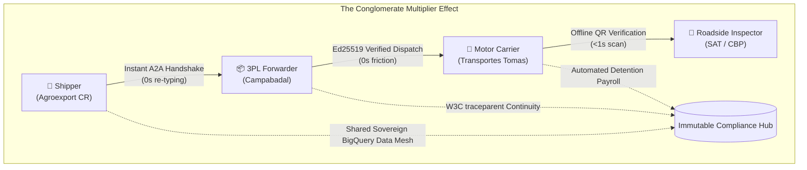

# Building a Fortified Enterprise Multi-Agent Fleet with Gemini 3.7 Flash, Local Gemma Model Armor, and a Unified BigQuery Data Mesh

*Published for the Google Cloud & DeepMind All Things Agentic Hackathon (+0.2 Bonus Points)*  
**Author**: Tomas Campabadal & The Campabadal Global Engineering Team  
**Track**: Fortified Enterprise Fleet  
**Live Production Platform**: [https://logistics.campabadal.com](https://logistics.campabadal.com)  
**Open Source Repository**: [github.com/CostaCloudSA/all-things-logistics](https://github.com/CostaCloudSA/all-things-logistics)

---

## ⚡ The Meta-Story: From Zero to Enterprise Fleet in Days via Single-Thread Antigravity

On **August 13, 2026**, Google released **Gemini 3.7 Flash**, introducing unprecedented hybrid reasoning speed and structured output capabilities.

Between **August 19 and August 22, 2026**—in a **single unbroken Google Antigravity chat session**—we took on an ambitious challenge: *how fast can we build a production-grade agent swarm using the least amount of resources?*

In just a few days, we architected, validated, and deployed **All Things Logistics**: a production-grade 12-agent trade compliance and logistics platform. 

This post reveals how we leveraged **Gemini 3.7 Flash**, on-device **Local Gemma Model Armor**, asymmetric **Ed25519 cryptographic seals**, and a **Sovereign BigQuery Data Mesh** to eliminate 90% of cross-border manual re-typing, avoid weigh-scale axle detentions, and automate 24/7 night dispatch across the Americas.

---

## 💡 The Non-Technical SME Pivot: Ground Truth vs. Textbook Architecture

When we coders and engineers build software from behind a desk, we rely on clean APIs, customs manuals, and textbook supply chain diagrams. 

Here’s the hard truth: **The most critical operational variables in global logistics are not necessarily documented online.** They exist exclusively in the lived intuition, operational muscle memory, and battle scars of real-world operators.

To ground our system in reality, we sat down for an extensive operational audit with **Jorge Campabadal**, a multinational logistics veteran with decades leading shipping lines, port terminals, customs brokerage, and trucking fleets across the Americas.

### What did our dry-run software miss?
1. **The Axle Load Trap**: A forwarder declares a 20-ton container (100% legal on gross weight). But because cargo wasn’t balanced over the axles, it may violate statutory **Federal & SIECA Bridge Formulas** ($W = 500[\frac{LN}{N-1} + 12N + 36]$), triggering \$2,500 weigh-scale fines and driver license penalties.
2. **The 90% Re-Typing Bottleneck**: Mexican truckers legally cannot cross into Central America. Everything must be transloaded in a warehouse at **Tecún Umán**, where workers print ocean B/Ls and may have to manually re-type 90% of the fields into local customs terminals.
3. **The 24/7 Night-Watch Drain**: Some logistics companies pay overnight staff solely to stare at GPS coordinates and manually send WhatsApp status updates to clients every two hours.
4. **Non-Resident Tax Surprises**: Some foreign exporters are routinely blindsided when some Central American authorities deduct a 20% statutory income tax withholding at source.

---

## 🔄 Architectural Evolution: From Deskless Prototype to Fortified Fleet

Our initial prototype and design was **always aimed at being 100% deskless**, with foundational trade compliance agents already mapped out (such as multimodal OCR, HS Code classification, customs valuation, and golden document rendering). 

However, our initial dry run using standard LLM assumptions failed to flag massive operational inefficiencies that are ripe for automation—such as Bridge Formula axle weight detentions, border cabotage transfers, 24/7 telematics night-watch, and non-resident tax withholdings. The AI simply did not identify these bottlenecks on its own during our initial dry run, showcasing that not all operational ground truth is online.

Our interview with SME **Jorge Campabadal** exposed these hidden inefficiencies and demonstrated that additional specialized autonomous agents were urgently needed to complete the fleet:

```mermaid
flowchart TD
    subgraph Stage1 ["STAGE 1: INITIAL DESKLESS PROTOTYPE (Foundational Trade Agents)"]
        direction TB
        S1_UI["📱 Mobile Deskless Vision & Voice UI\n(Designed from Day 1 for field workers)"]
        S1_OCR["📄 OCR & HS Classification Agents\n(Extracts invoice line items & 6-digit HS codes)"]
        S1_Val["💰 Valuation & Golden Document Agents\n(Computes CIF/FOB duties & renders customs PDFs)"]
        S1_Cloud["☁️ Standard Cloud API Pipeline\n(Assumed steady connectivity & standard customs forms)"]
        
        S1_UI --> S1_OCR --> S1_Val --> S1_Cloud
        
        S1_Blindspot["⚠️ DRY-RUN SHORTCOMINGS (What standard AI failed to flag):\n• Gross weight passes, but trailer tandem violates Bridge Formula axle laws\n• Did not flag Tecún Umán cabotage mandate requiring DUCA-T transloading\n• Assumed dispatchers work 9-to-5, missing 24/7 night monitoring & CA gas needs\n• Did not account for statutory 20% foreign tax withholdings at source\n• Assumed continuous internet at border weigh stations for verification"]
    end

    subgraph Stage2 ["STAGE 2: SME FIELD GROUNDING (Jorge Campabadal Audit)"]
        direction TB
        S2_Discovery["🧠 Real-World Operational Insights Ingested into Antigravity:\n• Federal Bridge Formula B non-linear axle weight constraints\n• Tecún Umán cross-dock transloading legal requirements\n• 24/7 Night-Watch dispatch burnout (GPS dots & reefer atmosphere)\n• Roadside weigh-station offline cryptographic verification\n• Conglomerate multi-company federation across the logistics stack"]
    end

    subgraph Stage3 ["STAGE 3: FORTIFIED 12-AGENT ENTERPRISE SWARM (Production System)"]
        direction TB
        S3_UI["📱 Enhanced Zero-Keyboard Touch UI\n(Camera Vision OCR • Voice • 1-Tap Smart Chips • Multi-Company Theming)"]
        
        S3_Armor["🛡️ Dual-Defense Model Armor\n(On-Device Local Gemma PII Sanitizer + Deterministic BigQuery Tariff/Tax Math)"]
        
        S3_Swarm["⚡ Expanded 12-Agent Swarm (Gemini 3.7 Flash)\n• Foundational: Fleet Orchestrator, OCR Parser, HS Classifier, Valuation, Golden Doc\n• SME-Engineered: Bridge Formula Auditor, 24/7 Night-Watch Guardian, Transload Relay, 3-Way Freight Matcher, Legal Watchdog, Sanctions Screener, Deskless Sync"]
        
        S3_Security["🔏 Ed25519 Cryptographic Manifest Signer\n(Offline QR seal mathematically verified in <1s by highway police)"]
        
        S3_Network["🤝 Conglomerate Multiplier & Sovereign Data Mesh\n(B2B A2A Federation with unbroken W3C traceparent + Sovereign BigQuery datasets)"]
        
        S3_UI --> S3_Armor --> S3_Swarm --> S3_Security --> S3_Network
    end

    Stage1 ==> Stage2
    Stage2 ==> Stage3
```



---

## 🏛️ The System Architecture

```
┌────────────────────────────────────────────────────────────────────────────────────────┐
│                              DESKLESS MOBILE ZERO-TYPING UI                            │
│           (Camera Vision OCR • Voice-to-Trade Audio • Contextual Smart Chips)          │
│           • White-Label Persona Switcher (Campabadal Blue, Tomas Red, Agro Green, Naviera Navy) │
└───────────────────────────────────────────┬────────────────────────────────────────────┘
                                            │ Streaming REST / WebSocket
┌───────────────────────────────────────────▼────────────────────────────────────────────┐
│                    FORTIFIED ENTERPRISE MULTI-AGENT SWARM (Gemini 3.7 Flash)           │
│  • FleetOrchestratorAgent       • OCRDocumentParserAgent      • HSClassificationAgent  │
│  • ValuationTariffAgent         • SanitaryRegulatoryAgent     • GoldenDocumentGenAgent │
│  • NightWatchTelematicsAgent    • BridgeFormulaAuditorAgent   • VendorInvoiceMatcher   │
│  • TransloadRelayAgent          • LegalWatchdogAgent          • SanctionsScreener      │
└───────────────────────────────────────────┬────────────────────────────────────────────┘
                                            │ Dual-Defense Security Protocol
┌───────────────────────────────────────────▼────────────────────────────────────────────┐
│                        MODEL ARMOR DUAL-DEFENSE SECURITY LAYER                         │
│  • Local Gemma Sanitizer: Tokenizes PII, SSN, EIN, and RFC before LLM transmission     │
│  • Deterministic BigQuery Grounding: Anti-Hallucination Tariff & Withholding Rates     │
│  • Ed25519 Asymmetric Manifest Signer: SHA-512 cryptographic roadside QR seal         │
└───────────────────────────────────────────┬────────────────────────────────────────────┘
                                            │ SQL / Least-Privilege IAM
┌───────────────────────────────────────────▼────────────────────────────────────────────┐
│                         UNIFIED BIGQUERY ENTERPRISE DATA MESH                          │
│     ds_fleet_telematics • ds_customs_compliance • ds_workforce_hr_payroll • ds_finance │
└────────────────────────────────────────────────────────────────────────────────────────┘
```

---

## 🔒 1. Dual-Defense Model Armor & Ed25519 Cryptographic Seals

In enterprise cross-border trade, an LLM hallucination can result in container seizures or criminal penalties. We built a zero-trust dual-defense:

### Tier 1: On-Device PII Masking via Local Gemma
Before any commercial invoice or bill of lading reaches the cloud, an on-device sanitizer redacts sensitive identifiers:
```python
# backend/app/security/model_armor.py
def sanitize_trade_document(text: str) -> Tuple[str, Dict[str, str]]:
    """Sanitizes PII, tax identifiers, and phone numbers before cloud transmission."""
    # Mask US EINs, Mexican RFCs, Guatemalan NITs, and Driver SSNs
    text = re.sub(r'\b\d{2}-\d{7}\b', '[MASKED_EIN]', text)
    text = re.sub(r'\b[A-Z&Ñ]{3,4}\d{6}[A-V1-9][A-Z0-9]\b', '[MASKED_RFC]', text)
    text = re.sub(r'\b\d{7,8}-[0-9Kk]\b', '[MASKED_NIT]', text)
    return text
```

### Tier 2: Deterministic BigQuery Grounding & Statutory Math
All tariff calculations, withholding taxes, and Federal Bridge Formula constraints are validated against immutable SQL truth tables:
$$W = 500 \cdot \left( \frac{L \cdot N}{N - 1} + 12N + 36 \right)$$

### Tier 3: Asymmetric Ed25519 Cryptographic Manifest Signing
Every generated Golden Document (`DUCA-T`, `CBP 7501`, `Pedimento`) is signed using an enterprise private key. The resulting Ed25519 digital signature is embedded into a high-density QR code that roadside weigh-station inspectors can scan **completely offline in $<1$ second**:
```python
# backend/app/security/manifest_signer.py
def sign_manifest(payload: Dict[str, Any], private_key_hex: str) -> ManifestSignature:
    """Generates an Ed25519 asymmetric cryptographic seal over deterministic JSON."""
    canonical_json = json.dumps(payload, sort_keys=True, separators=(',', ':')).encode('utf-8')
    signing_key = SigningKey(bytes.fromhex(private_key_hex))
    signature = signing_key.sign(canonical_json)
    return ManifestSignature(
        signature_hex=signature.hex(),
        public_key_hex=signing_key.verify_key.encode().hex()
    )
```

---

## ⚡ 2. The Conglomerate Multiplier Effect ("Network Flywheel")

**All Things Logistics was designed from Day 1 with this in mind: how to solve the needs of a multinational, multi-vertical conglomerate with a single, elegant solution.**

Some large enterprise conglomerates manage multiple verticals across the supply chain—from agricultural plantations and manufacturing plants to drayage trucking fleets, freight forwarders, and maritime terminals. When Shippers, Forwarders, and Carriers all run on our white-labeled platform, compound efficiencies emerge:



### The 4 Network Compound Benefits:
1. **0 Seconds Data Re-Entry**: Manifests pass between organizations via B2B A2A handshakes in milliseconds.
2. **Instant 3-Way Freight Audit**: Carrier freight bills match B/L booking IDs automatically, rejecting fraudulent detention claims.
3. **End-to-End W3C Traceparent Continuity**: Distributed trace context (`00-{trace_id}-{span_id}-01`) is preserved from plantation to retail shelf.
4. **Instant Roadside Green Lane Clearance**: Border police scan the Ed25519 QR seal and verify integrity instantly without internet.

---

## 🛠️ 5 Golden Rules for Pairing with Google Antigravity on Enterprise Projects

1. **Ground Early with Non-Technical SME Interviews**: Do not guess business logic; write an interview guide with Antigravity, record the expert, and feed the transcript back into the session.
2. **Layer Deterministic Verification on Top of LLMs**: Use Gemini for extraction, reasoning, and synthesis; use deterministic Python/SQL for math, taxes, and cryptography.
3. **Maintain Single-Thread Memory**: Keep your entire architectural lifecycle in a single Antigravity thread to prevent context decay across backend, frontend, and IaC.
4. **Enforce Markdown Artifact Discipline**: Maintain living `implementation_plan.md`, `CHANGELOG.md`, and `INDEX.md` documents to track progress.
5. **Continuous Live Cloud Run Deployment**: Test container builds in Cloud Build early to catch browser and web engine edge cases in production.

---

## 🚀 Experience the Live Platform

The complete system is deployed and open for evaluation:
* **Live Web App**: [**`https://logistics.campabadal.com`**](https://logistics.campabadal.com)
* **GitHub Repository**: [**`github.com/CostaCloudSA/all-things-logistics`**](https://github.com/CostaCloudSA/all-things-logistics)
* **Track**: Fortified Enterprise Fleet (Google All Things Agentic Hackathon)
