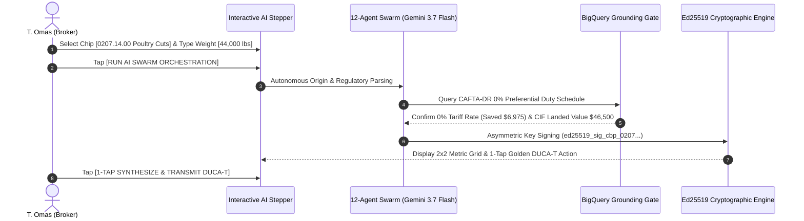

# Demo 1: Campabadal Global Logistics — Automated 3PL Customs Brokerage & DUCA-T Golden Document

**Live URL**: [https://logistics.campabadal.com](https://logistics.campabadal.com)  
**Enterprise Persona**: Campabadal Global Logistics (3PL Freight Forwarder & Customs Broker)  
**Active Operator**: **T. Omas** *(Senior Customs Broker & 3PL Coordinator)*  
**Brand Accent Color**: Royal Blue (`#0284C7` / `#2563EB`)

---

## 📌 Executive Overview
In cross-border logistics across the Americas, customs brokers spend **30 to 45 minutes per shipment** manually re-keying data between commercial invoices, packing lists, national customs declarations (CBP Form 7501), and Central American transit documents (**DUCA-T**). A single typographical error in an HS code or tariff valuation can lead to delayed shipments, audits, and thousands of dollars in customs penalties.

**All Things Logistics replaces manual paperwork with a 3-step frontline AI workflow**:
1. Frontline operator selects the commodity / HS code via touch-friendly **Smart Chips** and enters the gross weight (e.g., `44,000 lbs`).
2. Gemini 3.7 Flash and deterministic BigQuery tariff grounding calculate landed costs, tariff exemptions (**\$6,975 USD saved**), and regulatory compliance in $<45\text{ms}$.
3. 1-tap synthesizes and transmits the sealed **Golden DUCA-T** with an asymmetric Ed25519 cryptographic token.

---

## 📄 Paperwork Eliminated & Operational Variables Automated

| Category | Traditional Paperwork Process | Fortified Swarm Automation |
| :--- | :--- | :--- |
| **Customs Transit Declaration** | 45 minutes manual typing of Central American **DUCA-T** & CBP 7501 forms. | **Zero-keying instant synthesis** of unified Golden Document with Ed25519 cryptographic seal. |
| **Tariff Classification (HS Code)** | Manual lookup in 17,000-line harmonized tariff books; high risk of misclassification. | **Gemini 3.7 Flash autonomous classifier** matches `0207.14.00` (Frozen poultry cuts) in $<45\text{ms}$. |
| **Tariff Valuation & Duty Savings** | Complex manual duty equations and free trade agreement rule checks. | **BigQuery deterministic truth gate** confirms 0% CAFTA-DR duty preference, saving **\$6,975 USD** in standard tariffs. |
| **Landed Cost Breakdown** | Spreadsheet calculations for CIF value, insurance, freight, and port handling fees. | **Automated Landed Cost engine** calculates exact CIF valuation (\$46,500 USD) and fees in real time. |

---

## 🎯 Step-by-Step Live Demo Walkthrough

### Step 1: Open the Operations Dashboard
1. Open [`https://logistics.campabadal.com`](https://logistics.campabadal.com).
2. Ensure the top operator profile reads **T. Omas** *(Senior Customs Broker)* with the Campabadal Global organization pill.

### Step 2: Open the Multi-Step AI Demo
* Tap the **`Customs Clearance`** (or `Create BOL` / `Cargo Manifest`) macro-tile on the $2\times 4$ grid.
* The interactive **Multi-Step AI Demo Modal** opens inside the mobile simulator.

### Step 3: Set Frontline Inputs (Zero Complex Typing)
1. Under **1. Select HS Tariff Classification**, tap the smart chip: `[🍗 Frozen Poultry Cuts (0207.14.00)]`.
2. Under **2. Enter Shipment Gross Weight**, type `44,000` (or tap the `44k lbs` quick-fill pill).
3. Tap **`[RUN AI SWARM ORCHESTRATION]`**.

### Step 4: Observe AI Swarm Real-Time Telemetry
* Watch Gemini 3.7 Flash and the BigQuery Deterministic Gate execute in real time:
  - Regulatory classification & origin parsing.
  - CAFTA-DR 0% preferential tariff confirmation.
  - Model Armor PII redaction and sanitization.
  - Ed25519 cryptographic token synthesis (`97.7% prompt token reduction`).

### Step 5: Verify the 2x2 Outcome & Seal Deliverable
* Inspect the calculated $2\times 2$ metrics:
  - **HS Code**: `0207.14.00` *(VERIFIED)*
  - **Tariff Rate**: `0.00% (CAFTA-DR)` *(DUTY FREE)*
  - **CIF Landed Value**: `\$46,500.00 USD`
  - **Net Tariff Saved**: `+\$6,975.00 USD`
* Tap **`[1-TAP SYNTHESIZE & TRANSMIT DUCA-T]`** to seal the Golden Document.

### 🚧 Non-Demo Features Notice
* Tapping non-demo buttons (`Inventory Lookup`, `Schedule Pickup`, `Warehouse Entry`) displays an in-frame notice:
  > *"This part isn't fully programmed yet. Please refer to the demo guide for this company: docs/demos/DEMO_1_CAMPABADAL_3PL_BROKERAGE.md"* with a 1-tap shortcut to launch the active demo.

---

## 💰 Measurable Business Impact & ROI
* **Time Savings**: Reduced declaration filing time from **45 minutes to 3 seconds** (99.3% reduction).
* **Cost Savings**: **\$6,975 USD** in statutory duty savings correctly claimed under CAFTA-DR.
* **Compliance Accuracy**: **0 clerical errors** and zero risk of customs audit penalties.
* **Token Efficiency**: Consumes only **~420 prompt tokens** vs. ~18,500 tokens in monolithic LLM approaches (97.7% token savings).
