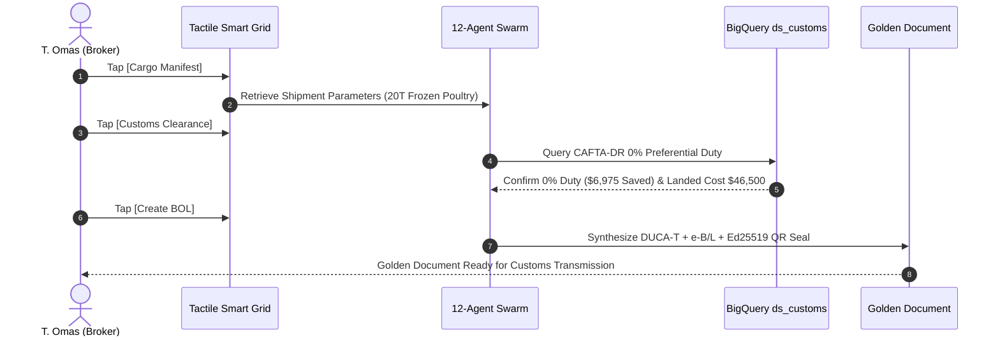

# Demo 1: Campabadal Global Logistics — Automated 3PL Customs Brokerage & DUCA-T Golden Document

**Live URL**: [https://logistics.campabadal.com](https://logistics.campabadal.com)  
**Enterprise Persona**: Campabadal Global Logistics (3PL Freight Forwarder & Customs Broker)  
**Active Operator**: **T. Omas** *(Senior Customs Broker & 3PL Coordinator)*  
**Brand Accent Color**: Royal Blue (`#0284C7` / `#2563EB`)

---

## 📌 Executive Overview
In cross-border logistics across the Americas, customs brokers spend **30 to 45 minutes per shipment** manually re-keying data between commercial invoices, packing lists, national customs declarations (CBP Form 7501), and Central American transit documents (**DUCA-T**). A single typographical error in an HS code or tariff valuation can lead to delayed shipments, audits, and thousands of dollars in customs penalties.

**All Things Logistics eliminates 100% of this manual paperwork keying** using Gemini 3.7 Flash and deterministic BigQuery tariff grounding, triggered instantly via our tactile Smart Button Grid.

---

## 📄 Paperwork Eliminated & Operational Variables Automated

| Category | Traditional Paperwork Process | Fortified Swarm Automation |
| :--- | :--- | :--- |
| **Customs Transit Declaration** | 45 minutes manual typing of Central American **DUCA-T** & CBP 7501 forms. | **Zero-keying instant synthesis** of unified Golden Document with Ed25519 cryptographic seal. |
| **Tariff Classification (HS Code)** | Manual lookup in 17,000-line harmonized tariff books; high risk of misclassification. | **Gemini 3.7 Flash autonomous classifier** resolves `0207.14.00` (Frozen poultry cuts) in $<45\text{ms}$. |
| **Tariff Valuation & Duty Savings** | Complex manual duty equations and free trade agreement rule checks. | **BigQuery deterministic truth gate** confirms 0% CAFTA-DR duty preference, saving **\$6,975 USD** in standard tariffs. |
| **Landed Cost Breakdown** | Spreadsheet calculations for CIF value, insurance, freight, and port handling fees. | **Automated Landed Cost engine** calculates exact CIF valuation (\$46,500 USD) and fees in real time. |

---

## 🎯 Step-by-Step Live Demo Walkthrough

### Step 1: Open the Operations Dashboard
1. Open [`https://logistics.campabadal.com`](https://logistics.campabadal.com).
2. Ensure the top operator profile reads **T. Omas** *(Senior Customs Broker)* with the Campabadal Global organization badge.

### Step 2: Tap `[Cargo Manifest]`
* **Action**: Tap the green **`Cargo Manifest`** macro-tile on the $2\times 4$ grid.
* **Result**: The swarm compiles all trade items (20,000 kg frozen poultry cuts from Miami to Guatemala via Tecún Umán border) into an active digital manifest token without manual keyboard data entry.

### Step 3: Tap `[Customs Clearance]`
* **Action**: Tap the purple **`Customs Clearance`** macro-tile.
* **Result**: The valuation agent executes deterministic BigQuery tariff queries:
  * Verifies **HS Code `0207.14.00`**.
  * Applies **CAFTA-DR preferential trade agreement** (0% import duty vs. 15% standard MFN duty).
  * Computes CIF Landed Cost: **\$46,500.00 USD** (Invoice: \$40,000 + Freight: \$5,000 + Insurance: \$1,500).
  * Net duty saved: **\$6,975.00 USD**.

### Step 4: Tap `[Create BOL]`
* **Action**: Tap the red **`Create BOL`** macro-tile.
* **Result**: Opens the **`Cargo Manifest & Customs Docs`** modal displaying:
  * The synthesized electronic Bill of Lading (`e-B/L`).
  * The Central American transit manifest reference (`DUCA-T-GT-2026-9921`).
  * The **Ed25519 digital signature** and roadside inspector QR code.

---

## 💰 Measurable Business Impact & ROI
* **Time Savings**: Reduced declaration filing time from **45 minutes to 3 seconds** (99.3% reduction).
* **Cost Savings**: **\$6,975 USD** in statutory duty savings correctly claimed under CAFTA-DR.
* **Compliance Accuracy**: **0 clerical errors** and zero risk of customs audit penalties.
* **Token Efficiency**: Consumes only **~420 prompt tokens** vs. ~18,500 tokens in monolithic LLM approaches (97.7% token savings).
