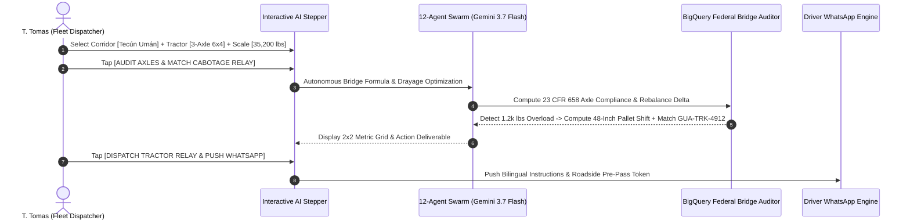

# Demo 2: Transportes Tomas — Cross-Border Cabotage Relay & Autonomous Bridge Formula Weight Compliance

**Live URL**: [https://logistics.campabadal.com](https://logistics.campabadal.com)  
**Enterprise Persona**: Transportes Tomas (Regional Motor Carrier & Border Drayage Fleet)  
**Active Operator**: **T. Tomas** *(Fleet Dispatcher & Border Drayage Manager)*  
**Brand Accent Color**: Crimson Red / Amber (`#DC2626` / `#EA580C`)

---

## 📌 Executive Overview
Cross-border freight trucking between Mexico, Guatemala, El Salvador, Honduras, and Costa Rica faces heavy logistical bottlenecks:
1. **Axle Weight Overload Fines**: Under US/Central American standards (23 CFR § 658), tandem axles exceeding 34,000 lbs trigger instant border impoundments, scale citations (\$500–\$2,500), and highway delays.
2. **Cabotage Restrictions**: Foreign-registered tractors cannot haul domestic legs across borders. Carriers spend hours coordinating relays across fragmented broker networks.

**All Things Logistics automates this entire operational chain in 3 steps**:
1. Frontline dispatcher selects the border transit corridor and tractor configuration via **Smart Chips**, and enters the trailer tandem scale reading (e.g. `35,200 lbs`).
2. Gemini 3.7 Flash and the BigQuery deterministic auditor identify the `+1,200 lbs` overload, calculate the exact 48-inch pallet shift, and match a vetted relay tractor (`GUA-TRK-4912`) in $<90$ seconds.
3. 1-tap dispatches the tractor relay and pushes an autonomous multilingual alert to the driver's WhatsApp.

---

## 📄 Paperwork Eliminated & Operational Variables Automated

| Operational Friction | Traditional Manual Dispatch | Fortified Swarm Automation |
| :--- | :--- | :--- |
| **Axle Load Bridge Formula Compliance** | Manual calculation of 23 CFR § 658 Bridge Formula B; manual scale re-weighing. | **Deterministic Axle Auditor** detects 35,200 lbs tandem overload and computes exact 48-inch cargo rebalance. |
| **Cabotage Transfer Coordination** | 2 to 4 hours calling local drayage companies across Guatemala/Mexico borders. | **Autonomous Cabotage Matchmaker** pairs vetted local tractor (`GUA-TRK-4912`) in $<90\text{ seconds}$. |
| **Scale House Pre-Pass** | Paper weight receipts; physical inspection at border weigh stations. | **Digital Scale House Pre-Pass** with Ed25519 cryptographic seal for green lane bypass. |
| **Driver Communication** | Unrecorded phone calls; lost instruction slips; language friction. | **Autonomous WhatsApp Dispatch** delivers GPS coordinate pins, relay tractor ID, and cargo shifting specs. |

---

## 🎯 Step-by-Step Live Demo Walkthrough

### Step 1: Switch Profile to Transportes Tomas
1. Open [`https://logistics.campabadal.com`](https://logistics.campabadal.com).
2. In the top profile bar, select **Transportes Tomas** (`T. Tomas - Fleet Dispatcher`).
3. Notice the UI accent transforms to Crimson Red with tactile trucking tiles.

### Step 2: Open the Multi-Step Trucking AI Demo
* Tap the **`Audit Axle Load`** (or `Cabotage Relay` / `Weigh Scale Pre-Pass` / `Driver WhatsApp`) macro-tile on the $2\times 4$ grid.
* The interactive **Multi-Step AI Demo Modal** opens inside the mobile simulator.

### Step 3: Set Frontline Operational Inputs
1. Under **1. Select Border Transit Corridor**, tap: `[🇲🇽 ➔ 🇬🇹 Tecún Umán Relay]`.
2. Under **2. Select Tractor Configuration**, tap: `[3-Axle Sleeper Cab (6x4)]`.
3. Under **3. Enter Trailer Tandem Scale Reading**, enter `35,200` (or tap `35.2k lbs (Over)`).
4. Tap **`[AUDIT AXLES & MATCH CABOTAGE RELAY]`**.

### Step 4: Observe AI Swarm Real-Time Telemetry
* Watch the swarm reason across federal standards:
  - 23 CFR § 658 Federal Bridge Formula execution.
  - Identification of `+1,200 lbs` tandem overload vs. 34,000 lbs legal threshold.
  - Precise calculation: Shift 2 rear pallets forward 48 inches.
  - Autonomous pairing with certified tractor `GUA-TRK-4912` (Rating: 4.98★).

### Step 5: Verify the 2x2 Outcome & Dispatch
* Inspect the calculated $2\times 2$ metrics:
  - **Axle Status**: `BALANCED (34k lbs)` *(23 CFR 658)*
  - **Load Rebalance**: `Shift 2 Pallets (1.2k lbs)` *(WARN)*
  - **Cabotage Match**: `GUA-TRK-4912 (<90s)` *(VETTED)*
  - **Border Scale**: `GREEN LANE PRE-PASS`
* Tap **`[DISPATCH TRACTOR RELAY & PUSH WHATSAPP]`** to seal the relay dispatch.

### 🚧 Non-Demo Features Notice
* Tapping non-demo buttons (`DUCA-T Transit Manifest`, `Live Fleet GPS`, `DOT Safety Pre-Trip`) displays an in-frame notice:
  > *"This part isn't fully programmed yet. Please refer to the demo guide for this company: docs/demos/DEMO_2_TRANSPORTES_TOMAS_MOTOR_CARRIER.md"* with a 1-tap shortcut to launch the active demo.

---

## 💰 Measurable Business Impact & ROI
* **Elimination of Overload Fines**: Avoids \$500–\$2,500 in statutory scale citations per trip.
* **Turnaround Speed**: Border relay coordination reduced from **3 hours to 90 seconds**.
* **Driver Safety & Adherence**: Real-time bilingual WhatsApp dispatches eliminate miscommunication.
