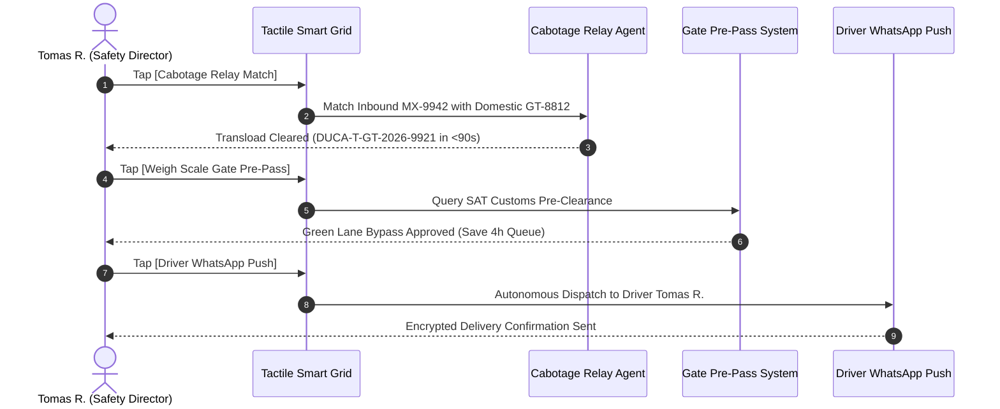

# Demo 2: Transportes Tomas — Cross-Border Cabotage Relay & Automated Driver Dispatch

**Live URL**: [https://logistics.campabadal.com](https://logistics.campabadal.com)  
**Enterprise Persona**: Transportes Tomas (Regional Motor Carrier & Heavy Drayage Fleet)  
**Active Operator**: **Tomas R.** *(Fleet Safety Director & Border Drayage Dispatcher)*  
**Brand Accent Color**: Crimson Red (`#DC2626`)

---

## 📌 Executive Overview
Cross-border motor carriers operating between Mexico and Central America face strict **cabotage laws**: foreign tractor heads (e.g., Mexican registered tractors) are legally prohibited from hauling cargo domestically inside Guatemala or El Salvador. As a result, carriers must execute bonded **cross-dock tractor swaps** at border yards like Tecún Umán.

Traditionally, this requires physical paper transload exchange manifests, telephone dispatch coordination, physical trip inspection sheets, and hours waiting at border customs gates.

**All Things Logistics automates the entire cabotage relay matching in under 90 seconds**, provides digital Weigh Scale Gate Pre-Passes for green-lane border bypass, and pushes autonomous turn-by-turn dispatches to driver WhatsApp inboxes with zero paper forms.

---

## 📄 Paperwork Eliminated & Operational Variables Automated

| Category | Traditional Paperwork Process | Fortified Swarm Automation |
| :--- | :--- | :--- |
| **Cabotage Transload Manifest** | Manual paper equipment handover receipts and bonded customs yard forms at Tecún Umán. | **Autonomous Swarm matches inbound & outbound tractors** and issues Ed25519-signed transload manifest `DUCA-T-GT-2026-9921` in $<90$s. |
| **Border Scale Queuing** | Physical paperwork checks at border weigh scales resulting in 3 to 5 hour queue delays. | **Weigh Scale Gate Pre-Pass** validates pre-cleared token for instant **Green Lane Departure**. |
| **Driver Dispatch Instructions** | Printed trip manifests and voice phone calls to drivers across patchy cellular border regions. | **Autonomous WhatsApp Dispatch Push** transmits turn-by-turn route, seal codes, and transit tokens with zero typing. |
| **Legal Compliance** | Risk of \$10,000+ impound fines for unauthorized domestic cabotage transit. | **Automated jurisdiction validation** guarantees strict adherence to Central American SIECA & Mexican SCT rules. |

---

## 🎯 Step-by-Step Live Demo Walkthrough

### Step 1: Switch to the Transportes Tomas Persona
1. Open [`https://logistics.campabadal.com`](https://logistics.campabadal.com).
2. Open the top navigation drawer (`≡`) or go to the **Profile** tab and select **Transportes Tomas**.
3. Notice the UI theme dynamically updates to **Crimson Red (`#DC2626`)** and the operator profile changes to **Tomas R.** *(Fleet Safety Director)* with ID `SCT-MX-SAFETY-8821`.

### Step 2: Tap `[Cabotage Relay Match]`
* **Action**: Tap the orange **`Cabotage Relay Match`** macro-tile on the $2\times 4$ grid.
* **Result**: The Cabotage Transload Relay agent evaluates border yard inventory at the Tecún Umán bonded facility:
  * Detects incoming Mexican long-haul tractor `MX-9942`.
  * Matches with available Guatemalan drayage tractor `GT-8812` in **under 90 seconds**.
  * Synthesizes bonded transload manifest `DUCA-T-GT-2026-9921` with status **`CLEARED`**.

### Step 3: Tap `[Weigh Scale Gate Pre-Pass]`
* **Action**: Tap the dark teal **`Weigh Scale Gate Pre-Pass`** macro-tile.
* **Result**: Generates a digital pre-clearance token verified against SAT customs databases, authorizing the driver for **Green Lane Departure** and bypassing the typical 4-hour physical queue.

### Step 4: Tap `[Driver WhatsApp Push]`
* **Action**: Tap the sky-blue **`Driver WhatsApp Push`** macro-tile.
* **Result**: Triggers the 24/7 Night-Watch autonomous telematics agent to send an end-to-end encrypted dispatch update directly to the driver's phone with route coordinates, seal numbers, and delivery time windows.

---

## 💰 Measurable Business Impact & ROI
* **Turnaround Speed**: Border cross-dock pairing executed in **$<90$ seconds** (down from 4 hours of manual coordination).
* **Queue Time Reduction**: **3 to 4 hours saved** per border crossing via digital Gate Pre-Passes.
* **Legal Risk Elimination**: **Zero cabotage violation fines** (\$10,000+ savings per incident).
* **Driver Efficiency**: **100% paperless driver communication** via automated WhatsApp dispatches.
