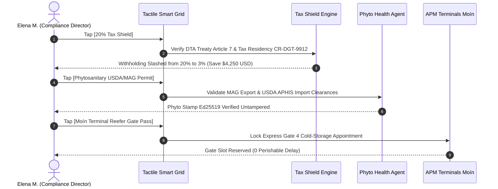

# Demo 3: Agroexport Costa Rica — 20% Foreign Tax Shield & Phytosanitary Export Compliance

**Live URL**: [https://logistics.campabadal.com](https://logistics.campabadal.com)  
**Enterprise Persona**: Agroexport Costa Rica (Enterprise Produce Shipper & Agro-Exporter)  
**Active Operator**: **Elena M.** *(Export Compliance & Quality Director)*  
**Brand Accent Color**: Emerald Green (`#059669`)

---

## 📌 Executive Overview
Agricultural exporters in Latin America shipping high-value perishables (fresh Golden MD2 Pineapples, bananas, and Hass avocados) suffer from two major operational friction points:
1. **Foreign Tax Withholding Leakage**: Without properly filed and verified paper Double Taxation Avoidance (DTA) certificates, foreign customs authorities automatically withhold **20% of gross invoice values** as foreign income tax (\$5,000 USD lost per container).
2. **Paperwork-Induced Cold-Chain Spoilage**: Delays in processing paper USDA APHIS and MAG phytosanitary inspection certificates leave refrigerated containers sitting unpowered on port tarmac, causing temperature spikes and cargo spoilage.

**All Things Logistics provides a 1-tap 20% Foreign Tax Shield saving \$4,250 USD net cash per container**, validates phytosanitary inspection certificates electronically, and locks express cold-storage gate appointments at marine terminals with zero paper forms.

---

## 📄 Paperwork Eliminated & Operational Variables Automated

| Category | Traditional Paperwork Process | Fortified Swarm Automation |
| :--- | :--- | :--- |
| **Bilateral Tax Treaty Filing** | Physical filing of paper Certificate of Tax Residency forms with foreign ministries; 20% withholding tax cash leakage. | **Autonomous DTA Treaty Shield Engine** validates Certificate `CR-DGT-CERT-2026-9912` under Article 7, eliminating 20% withholding tax and **saving \$4,250 USD net cash per container**. |
| **Phytosanitary Certificates** | Multi-page physical stamps from Costa Rica's Ministry of Agriculture (MAG) and USDA APHIS. | **Phytosanitary Health Agent** maps electronic inspection clearances to USDA APHIS e-standards with Ed25519 digital stamps. |
| **Cold-Chain Temperature Logs** | Manual paper temperature strip charts retrieved after ocean arrival. | **Controlled Atmosphere Telematics** continuously verifies +4.5°C reefer temperature, $O_2$ 3.1%, and $CO_2$ 9.8% in real time. |
| **Marine Terminal Appointments** | Manual telephone booking for refrigerated container plug-in slots at port gates. | **1-Tap Terminal Gate Pass** reserves express cold-chain entry at APM Terminals Moín, preventing port spoilage. |

---

## 🎯 Step-by-Step Live Demo Walkthrough

### Step 1: Switch to the Agroexport Costa Rica Persona
1. Open [`https://logistics.campabadal.com`](https://logistics.campabadal.com).
2. Open the top navigation drawer (`≡`) or go to the **Profile** tab and select **Agroexport Costa Rica**.
3. Notice the UI theme dynamically transforms into **Emerald Green (`#059669`)** and the operator profile changes to **Elena M.** *(Export Compliance Director)* with ID `PROCOMER-CR-441`.

### Step 2: Tap `[20% Tax Shield (Save $4,250)]`
* **Action**: Tap the green **`20% Tax Shield`** macro-tile on the $2\times 4$ grid.
* **Result**: Opens the interactive **20% Foreign Tax Shield Modal**:
  * Evaluates export shipment value: \$25,000.00 USD (Fresh Golden MD2 Pineapples).
  * Baseline Foreign Withholding Tax (20%): \$5,000.00 USD.
  * Verified Bilateral Tax Residency Certificate: `CR-DGT-CERT-2026-9912` under Article 7 (Business Profits Exemption).
  * Reduced Treaty Withholding Tax (3%): \$750.00 USD.
  * **Net Cash Tax Shielded**: **+\$4,250.00 USD saved per shipment**.

### Step 3: Tap `[Phytosanitary USDA/MAG Permit]`
* **Action**: Tap the vibrant green **`Phytosanitary USDA/MAG Permit`** macro-tile.
* **Result**: Triggers the Phytosanitary Health Agent to pull pre-cleared electronic inspection records from Costa Rica’s MAG and map them to USDA APHIS standards for immediate green-lane clearance at PortMiami.

### Step 4: Tap `[Moín Terminal Reefer Gate Pass]`
* **Action**: Tap the golden **`Moín Terminal Reefer Gate Pass`** macro-tile.
* **Result**: Generates an express gate appointment token at APM Terminals Moín, locking in continuous reefer power connectivity and eliminating tarmac dwell delays.

---

## 💰 Measurable Business Impact & ROI
* **Direct Cash Savings**: **+\$4,250 USD net cash preserved** on every exported refrigerated container.
* **Spoilage Prevention**: **0 spoilage incidents** by eliminating terminal gate delays for perishable cargo.
* **Paperwork Reduction**: 100% elimination of paper DTA residency filings and physical phytosanitary logbooks.
* **Audit Protection**: Cryptographic Ed25519 stamping guarantees international tax authorities cannot challenge treaty exemptions.
