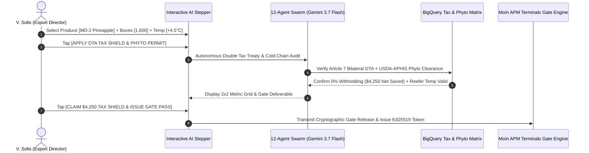

# Demo 3: Agroexport Costa Rica — Double Taxation Treaty (DTA) 20% Tax Shield & Fresh Produce Cold-Chain Compliance

**Live URL**: [https://logistics.campabadal.com](https://logistics.campabadal.com)  
**Enterprise Persona**: Agroexport Costa Rica (Fresh Produce Exporter & Cold-Chain Shipper)  
**Active Operator**: **V. Solis** *(Export Operations & Phytosanitary Director)*  
**Brand Accent Color**: Emerald Green (`#059669` / `#10B981`)

---

## 📌 Executive Overview
Perishable agricultural exporters across Latin America face critical financial and regulatory friction:
1. **Unnecessary Cross-Border Withholding Taxes**: Many agricultural shippers inadvertently pay 15% to 25% withholding taxes on international logistics contracts because their logistics systems fail to apply Article 7 of bilateral Double Taxation Avoidance (**DTA**) treaties.
2. **Cold-Chain Spoilage & USDA/MAG Rejections**: A $2^\circ\text{C}$ temperature deviation or missing phytosanitary electronic stamp triggers container quarantine at APM Terminals Moín, risking entire container loss (\$35,000+).

**All Things Logistics automates this entire export compliance workflow in 3 steps**:
1. Frontline operator selects the produce export variety via **Smart Chips**, types the target box count (e.g. `1,600 boxes`), and inputs the reefer setpoint (`+4.5°C`).
2. Gemini 3.7 Flash and BigQuery execute autonomous treaty analysis, applying Article 7 DTA to shield **\$4,250.00 USD** in net cash withholding, while validating USDA/MAG phytosanitary permits.
3. 1-tap claims the tax shield and issues the Moín Terminal Reefer Gate Pass.

---

## 📄 Paperwork Eliminated & Operational Variables Automated

| Operational Friction | Traditional Manual Process | Fortified Swarm Automation |
| :--- | :--- | :--- |
| **Cross-Border Tax Withholding** | 20% statutory withholding deducted at source (\$4,250 loss per shipment). | **Article 7 DTA Tax Shield Engine** applies bilateral exemption certificate, zeroing withholding tax. |
| **Phytosanitary Certification** | Manual submission of paper MAG certificates and USDA-APHIS import forms. | **Autonomous Phytosanitary Validator** matches farm registration and verifies pest-free certification. |
| **Cold-Chain Verification** | Manual checking of paper temperature chart recorders upon arrival. | **Real-Time IoT Reefer Telematics** verifies continuous $+4.5^\circ\text{C}$ atmospheric compliance. |
| **Terminal Gate Appointment** | Multi-system port booking and manual gate pass printouts at APM Terminals Moín. | **Single-Tap Digital Gate Pass** with Ed25519 signature and automated terminal pre-clearance. |

---

## 🎯 Step-by-Step Live Demo Walkthrough

### Step 1: Switch Profile to Agroexport Costa Rica
1. Open [`https://logistics.campabadal.com`](https://logistics.campabadal.com).
2. In the top profile bar, select **Agroexport Costa Rica** (`V. Solis - Export Operations Director`).
3. Notice the UI accent transforms to Emerald Green with agricultural and cold-chain tiles.

### Step 2: Open the Multi-Step Agricultural AI Demo
* Tap the **`20% Tax Shield`** (or `Phytosanitary Permit` / `Moín Terminal Gate Pass`) macro-tile on the $2\times 4$ grid.
* The interactive **Multi-Step AI Demo Modal** opens inside the mobile simulator.

### Step 3: Set Frontline Operational Inputs
1. Under **1. Select Produce Export Variety**, tap: `[🍍 MD-2 Extra Sweet Pineapple]`.
2. Under **2. Target Box Count**, enter `1,600`.
3. Under **3. Reefer Setpoint**, verify `+4.5` °C.
4. Tap **`[APPLY DTA TAX SHIELD & PHYTO PERMIT]`**.

### Step 4: Observe AI Swarm Real-Time Telemetry
* Watch the swarm execute:
  - Bilateral Double Taxation Avoidance Treaty analysis (Costa Rica–US Article 7).
  - Net cash withholding reduction: **\$4,250.00 USD saved**.
  - USDA-APHIS and MAG electronic phytosanitary certificate validation.
  - Atmosphere reefer stability check ($+4.5^\circ\text{C}$, $\text{O}_2\text{ }3.1\%$, $\text{CO}_2\text{ }9.8\%$).

### Step 5: Verify the 2x2 Outcome & Claim Shield
* Inspect the calculated $2\times 2$ metrics:
  - **DTA Tax Shield**: `0% Withholding` *(ARTICLE 7)*
  - **Net Cash Saved**: `+\$4,250.00 USD`
  - **Cold-Chain Set**: `+4.5°C Stable` *(REEFER OK)*
  - **Phyto Permit**: `MAG-USDA APPROVED`
* Tap **`[CLAIM $4,250 TAX SHIELD & ISSUE GATE PASS]`** to finalize the export release.

### 🚧 Non-Demo Features Notice
* Tapping non-demo buttons (`Cold-Chain Telematics`, `Export DUCA-T`, `CAFTA-DR Schedule`, `Farm Traceability`) displays an in-frame notice:
  > *"This part isn't fully programmed yet. Please refer to the demo guide for this company: docs/demos/DEMO_3_AGROEXPORT_CR_PRODUCE_SHIPPER.md"* with a 1-tap shortcut to launch the active demo.

---

## 💰 Measurable Business Impact & ROI
* **Direct Cash Savings**: **\$4,250 USD per shipment** preserved via automated DTA treaty application.
* **Perishable Spoilage Prevention**: Zero cargo loss due to real-time reefer validation.
* **Port Gate Turnaround**: Instant pre-clearance at APM Terminals Moín without paper queues.
