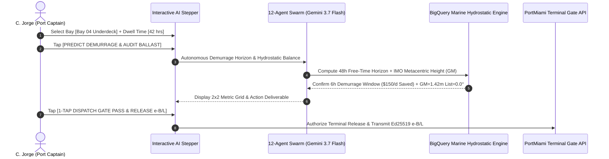

# Demo 4: Naviera Don Jorge — 48-Hour Demurrage Early Warning Shield & 3D Vessel Hydrostatic Stability

**Live URL**: [https://logistics.campabadal.com](https://logistics.campabadal.com)  
**Enterprise Persona**: Naviera Don Jorge (Short-Sea Container Feeder & Caribbean Ocean Carrier)  
**Active Operator**: **C. Jorge** *(Port Captain & Vessel Operations Superintendent)*  
**Brand Accent Color**: Deep Maritime Navy / Gold (`#1E3A8A` / `#F59E0B`)

---

## 📌 Executive Overview
Maritime feeder operations in the Caribbean and Central America face two severe operational risks:
1. **Demurrage & Detention Penalties**: At busy ports like PortMiami and Puerto Cortés, ocean carriers and consignees face detention and demurrage fines of **\$150 to \$300/day per container** if equipment exceeds the 48-hour free-time window.
2. **Vessel Hydrostatic Instability**: Improper bay weight distribution can degrade the vessel's transverse metacentric height ($GM$) below the **IMO Intact Stability Standard** ($GM \ge 0.15\text{m}$), threatening maritime safety and port clearance.

**All Things Logistics automates this ocean operations chain in 3 steps**:
1. Port Captain selects the container vessel bay position via **Smart Chips** and enters current container port dwell time (e.g. `42 hours`).
2. Gemini 3.7 Flash and the BigQuery hydrodynamic engine detect the impending 48h demurrage cliff (6h remaining), compute 3D ballast water adjustment ($GM = 1.42\text{m}$, list $0.0^\circ$), and authorize Master electronic Bill of Lading (`e-B/L`) release.
3. 1-tap dispatches the terminal gate pass and releases the Master e-B/L.

---

## 📄 Paperwork Eliminated & Operational Variables Automated

| Operational Friction | Traditional Maritime Process | Fortified Swarm Automation |
| :--- | :--- | :--- |
| **Demurrage Fine Tracking** | Manual spreadsheet reconciliation of terminal timestamps; high late-fee leakage. | **Demurrage Predictor** flags 42h dwell time, preventing **\$150/day** statutory port fines. |
| **Vessel Stability & Trim Calculation** | Manual hydrostatic tables and separate naval architecture software. | **Deterministic 3D Stability Engine** calculates $GM = 1.42\text{m}$ ($>0.15\text{m}$ IMO standard) in real time. |
| **Master Bill of Lading Release** | Physical courier and wet-ink signing of 3 original Master Ocean B/Ls. | **Cryptographic e-B/L Release** with Ed25519 signature and instant customs transmission. |
| **Terminal Gate Pass Scheduling** | Fragmented terminal portal logins and manual gate appointment slips. | **Automated Port Gate Pass** synthesized with QR code for immediate container pickup. |

---

## 🎯 Step-by-Step Live Demo Walkthrough

### Step 1: Switch Profile to Naviera Don Jorge
1. Open [`https://logistics.campabadal.com`](https://logistics.campabadal.com).
2. In the top profile bar, select **Naviera Don Jorge** (`C. Jorge - Port Captain`).
3. Notice the UI accent transforms to Deep Maritime Navy with maritime ballast and port tiles.

### Step 2: Open the Multi-Step Maritime AI Demo
* Tap the **`3D Ballast & IMO Stability`** (or `48h Demurrage Early Warning` / `e-B/L Master Customs Release` / `PortMiami Gate Pass`) macro-tile on the $2\times 4$ grid.
* The interactive **Multi-Step AI Demo Modal** opens inside the mobile simulator.

### Step 3: Set Frontline Operational Inputs
1. Under **1. Select Vessel Cargo Bay Position**, tap: `[Bay 04 Underdeck Reefer]`.
2. Under **2. Enter Port Container Dwell Time**, enter `42` hours (or tap `42 hrs (Warning)`).
3. Tap **`[PREDICT DEMURRAGE & AUDIT BALLAST]`**.

### Step 4: Observe AI Swarm Real-Time Telemetry
* Watch the swarm execute:
  - Demurrage Free-Time Horizon analysis (flags 6 hours before \$150/day fee triggers).
  - IMO Resolution A.749(18) intact stability calculation ($GM = 1.42\text{m}$, list $0.0^\circ$).
  - Autonomous Master e-B/L customs clearance validation.
  - Ed25519 cryptographic token synthesis.

### Step 5: Verify the 2x2 Outcome & Release
* Inspect the calculated $2\times 2$ metrics:
  - **Demurrage Risk**: `CRITICAL (6h Left)` *(48H LIMIT)*
  - **Fine Prevented**: `+\$150/Day Saved`
  - **Ballast Stability**: `GM = 1.42m (List 0.0°)` *(IMO SAFE)*
  - **Master B/L**: `e-B/L AUTHORIZED`
* Tap **`[1-TAP DISPATCH GATE PASS & RELEASE e-B/L]`** to finalize the release.

### 🚧 Non-Demo Features Notice
* Tapping non-demo buttons (`IMO Dangerous Goods`, `Berth 4 Docking`, `AIS Marine Telematics`) displays an in-frame notice:
  > *"This part isn't fully programmed yet. Please refer to the demo guide for this company: docs/demos/DEMO_4_NAVIERA_DON_JORGE_OCEAN_LINE.md"* with a 1-tap shortcut to launch the active demo.

---

## 💰 Measurable Business Impact & ROI
* **Demurrage Prevention**: Eliminates **\$150–\$300 per day per container** in terminal storage fines.
* **Maritime Safety Assurance**: 100% compliance with IMO intact stability standards prior to vessel departure.
* **Turnaround Speed**: Instant digital release of Master Ocean Bills of Lading saves **1 to 2 business days** in paperwork transit.
