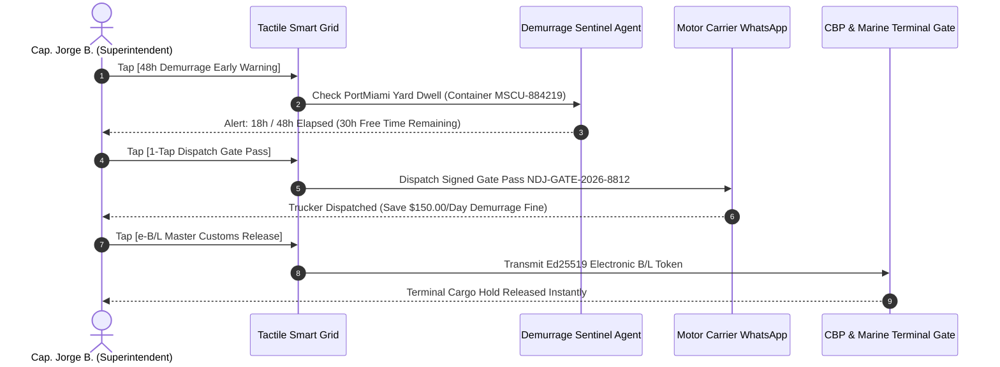

# Demo 4: Naviera Don Jorge — 48h Demurrage Early Warning & Automated e-B/L Master Release

**Live URL**: [https://logistics.campabadal.com](https://logistics.campabadal.com)  
**Enterprise Persona**: Naviera Don Jorge (Ocean Carrier & Marine Port Terminal Operator)  
**Active Operator**: **Cap. Jorge B.** *(Marine Superintendent & Port Terminal Coordinator)*  
**Brand Accent Color**: Navy Blue (`#1E3A8A`) / Maritime Gold (`#F59E0B`)

---

## 📌 Executive Overview
Marine terminal operators and ocean feeder lines manage thousands of shipping containers in port yards. Two major operational bottlenecks generate significant financial losses:
1. **Unnecessary Demurrage Penalties**: Inbound import containers routinely exceed their 48-hour free dwell window in port container yards because drayage truckers are not notified in time, resulting in **\$150.00 to \$300.00 per day in demurrage penalty fines**.
2. **Paper Master Bill of Lading Holds**: Releasing cargo from customs and port gates requires physical, stamped original paper Bills of Lading, causing delays of 24 to 48 hours while documents are couriered between offices.

**All Things Logistics provides a 48-Hour Demurrage Early Warning sentinel that auto-dispatches Ed25519-signed gate passes to avoid \$150/day penalties**, and transmits cryptographic **e-B/L Master Releases** directly to CBP customs and marine terminal gates with zero paper couriers.

---

## 📄 Paperwork Eliminated & Operational Variables Automated

| Category | Traditional Paperwork Process | Fortified Swarm Automation |
| :--- | :--- | :--- |
| **Container Yard Demurrage** | Inactive yard tracking spreadsheets; late discovery after \$150/day detention penalties trigger. | **48h Demurrage Early Warning Sentinel** monitors dwell time (18h/48h free time) and **1-tap dispatches pre-cleared gate passes to truckers**, avoiding \$150/day fines. |
| **Master Bill of Lading Release** | Physical courier of stamped original paper Master B/L documents to port authorities and CBP customs. | **Cryptographic e-B/L Master Release** transmits digital release token with Ed25519 non-repudiation signature in $<1$ second. |
| **Terminal Gate Interchange (EIR)** | Paper equipment interchange receipts (EIR) stamped manually at terminal security booths. | **Digital Ed25519 Gate Pass (`NDJ-GATE-2026-8812`)** scanned optically at gate optical cameras with zero physical handling. |
| **Berth Window Docking** | Manual phone/email negotiation with harbor masters and terminal pilots for dock availability. | **Berth 4 Auto-Scheduler** locks arrival windows coordinated with tidal windows and crane gantry availability. |

---

## 🎯 Step-by-Step Live Demo Walkthrough

### Step 1: Switch to the Naviera Don Jorge Persona
1. Open [`https://logistics.campabadal.com`](https://logistics.campabadal.com).
2. Open the top navigation drawer (`≡`) or go to the **Profile** tab and select **Naviera Don Jorge**.
3. Notice the UI theme dynamically updates to **Navy Blue (`#1E3A8A`)** and the operator profile changes to **Cap. Jorge B.** *(Marine Superintendent)* with ID `IMO-CAPT-992140`.

### Step 2: Tap `[48h Demurrage Early Warning]`
* **Action**: Tap the golden amber **`48h Demurrage Early Warning`** macro-tile on the $2\times 4$ grid.
* **Result**: Opens the interactive **48-Hour Demurrage Early Warning Modal**:
  * Location: PortMiami Container Yard (Gate 4).
  * Yard Dwell Time: **18h elapsed / 48h free time window** (30 hours remaining).
  * Penalty Rate: **\$150.00 / day**.
  * Pre-Clearance Gate Pass Status: Prepared and ready for dispatch.

### Step 3: Tap `[1-Tap Dispatch Gate Pass (Save $150/Day)]`
* **Action**: Click the golden action button inside the Demurrage Card.
* **Result**: Generates and dispatches Ed25519-signed gate pass `NDJ-GATE-2026-8812` directly to the drayage motor carrier via WhatsApp. The driver enters the green lane and retrieves the container before free time expires, **saving \$150.00/day in penalty fees**.

### Step 4: Tap `[e-B/L Master Customs Release]`
* **Action**: Tap the vibrant green **`e-B/L Master Customs Release`** macro-tile on the grid.
* **Result**: Electronically transmits the master electronic Bill of Lading release token directly to CBP customs and marine terminal operating systems, releasing cargo holds with zero physical paper courier delays.

---

## 💰 Measurable Business Impact & ROI
* **Demurrage Cost Avoidance**: **100% elimination of late gate demurrage penalties** (\$150 to \$300/day per container).
* **Terminal Turnaround**: Cargo released from marine terminals **24 to 48 hours faster** by replacing physical paper Bills of Lading with cryptographic e-B/L tokens.
* **Paperwork Reduction**: Complete elimination of physical Equipment Interchange Receipts (EIR) and paper release vouchers.
* **Operational Fluidity**: Seamless coordination between marine terminal operators, ocean feeder lines, and drayage motor carriers.
